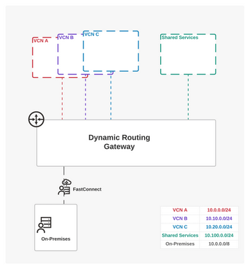

# Analyze Cloud Service Provider Offerings and Limitations
## Learn Common Cloud Service Provider Networking and Security Constraints
By the end of this lesson, you should be able to recognize the CSP's native constraints in visibility, security, and control.

"Compared with on-prem, where we have visibility into everything, in the cloud its hazy. We don't know if something is wrong and we don't get alerts if a region is having a problem"

### Limited Networking Capabilities
Cloud provides convenience and ease of use however it comes with limitations that can hinder organizations' ability to fully optimize their network infrastructure in the cloud.

1. Bandwidth Constraints
- CSP offer predefined bandwidth options for network resources according to fluctuating demands which can limit an organizations' ability to scale their network bandwidth

~ Cloud providers typically offer predefined bandwidth options for networking resources, limiting organizations' ability to scale their network bandwidth according to fluctuating demand. This can lead to performance bottlenecks during peak usage periods, affecting the responsiveness and reliability of critical applications and services.

2. Higher costs
- CSP impose higher costs for exceeding predefined bandwidth limits and for accessing premium networking features which can leave to unexpected expenses especially for dynamic workloads or high-volume data transfer requirements

~ Native networking solutions may impose additional costs for exceeding predefined bandwidth limits or for accessing premium networking features. This can result in unexpected expenses for organizations, especially those with dynamic workloads or high-volume data transfer requirements.

3. Lack of Advanced Features
- CSP lack advanced features suh as Quality of Service, traffic engineering, or advanced routing protocols to optimize network performance and ensure efficient data transmission

~ While cloud providers offer basic networking functionalities such as virtual networks, subnets, and load balancers, they may lack advanced networking features required for complex deployments. For example, organizations may require features like Quality of Service (QoS), traffic engineering, or advanced routing protocols to optimize network performance and ensure efficient data transmission.

### Cloud Provider Lock-In
- If an organization is too tightly integrated with a specific cloud provider's ecosystem, it can be difficult and costly to migrate to an alternative provider or adopting multi-cloud strategies.

~ Dependence on native networking solutions provided by individual cloud service providers can lead to a phenomenon known as cloud provider lock-in. This occurs when organizations become tightly integrated with a specific cloud provider's ecosystem, making it difficult or costly to migrate to alternative providers or adopt multicloud strategies. 

~ Several factors contribute to cloud provider lock-in, each presenting unique tasks for organizations seeking flexibility and portability in their cloud deployments. We’ll explore some of these now.

1. Compatibility Issues
- Compatibility between cloud platforms make it challenging to migrate workloads or replicate configurations in other cloud platforms

~ Cloud provider lock-in often arises due to compatibility issues between different cloud platforms and proprietary networking solutions. Organizations may customize their network configurations and dependencies to align with a specific cloud provider's offerings, making it challenging to migrate workloads or replicate configurations in alternative environments.

2. Lack of Interoperability 
~ Native networking solutions provided by cloud service providers may lack interoperability with third-party tools, platforms, or standards. This can restrict organizations' ability to integrate with external systems or leverage industry-standard networking protocols, limiting their flexibility and hindering interoperability across hybrid or multicloud environments.

3. Data Gravity and Transfer Costs
~ As organizations accumulate data within a specific cloud provider's environment, the cost and complexity of transferring data between providers increase significantly. This phenomenon, known as data gravity, exacerbates cloud provider lock-in by imposing substantial costs and logistical challenges on organizations seeking to migrate workloads or adopt multicloud strategies.

**By proactively addressing the opportunities of cloud provider lock-in, organizations can maintain agility, minimize risk, and optimize their cloud deployments for long-term success.**

### Security Concerns
- Using CSP platforms leaves the control/access of security to the CSP

~ Native networking solutions provided by cloud providers may lack comprehensive security features, leaving organizations vulnerable to threats. This concern is particularly significant in multicloud environments where maintaining consistent and distributed security policies across different providers can be challenging.

1. Limited Security Controls
- CSP offer only basic security control like Network Access Control Lists (NACLs) and Security Groups (SGs). With this limitation there's an increase in exposure to cybersecurity risks

~ Cloud providers may offer basic security controls such as Network Access Control Lists (NACLs) or Security Groups (SGs), but these may not provide sufficient protection against advanced threats or targeted attacks. Organizations may face limitations in implementing custom security policies or integrating with third-party security solutions, increasing their exposure to cybersecurity risks.

2. Data Privacy and Compliance 
- Storing data in a multi-cloud environment make cause a risk of data breaches or regulatory violations

~ Multicloud environments often involve processing and storing sensitive data across multiple cloud providers, raising concerns about data privacy and compliance with regulatory requirements. Organizations may struggle to ensure consistent data protection measures and compliance standards across disparate cloud environments, increasing the risk of data breaches or regulatory violations.

3. Identity and Access Management (IAM)
- Having a consistent IAM implementation across CSPs is difficult and can increase the risk of unauthorized access or insider threats

~ Inconsistent IAM implementations across cloud service providers can create security vulnerabilities and identity management challenges. Organizations may encounter difficulties in managing user identities, access controls, and permissions consistently across different cloud environments, increasing the risk of unauthorized access or insider threats.

### Inadequate Security
- More than 2X as many cloud network outages were caused by firewalls than by cyber attacks last year
- “Cost controls” and “visibility and troubleshooting” are the two biggest hurdles to taking full advantage of public cloud
- More than 1/3 reported that generative AI initiatives have not impacted cloud budgets or have even decreased them
- Companies continue to struggle to hire the necessary candidates to support cloud initiatives within their organization

### Considerations in Building Consistent Networks
- Establishing and maintaining consistent networks across multi-cloud environments is difficult. There are key considerations to achieve a consistent network.

~ Organizations face difficulties in establishing and maintaining consistent networks across multiple clouds, within individual clouds, and between different cloud environments. These considerations encompass various aspects of network management, including monitoring, day two operations, and visibility issues. Let’s find out more.

1. Lack of Interoperability
- Organizations may encounter compatibility issues when integrating networking components across multiple providers, making it difficult to create consistent network architectures.

~ Different cloud providers may offer basic networking services that lack interoperability, making it challenging to establish seamless connectivity between diverse cloud environments.

2. Complex Configuration Management
- Configuration Management in multiple clouds can lead to misconfigurations and security vulnerabilities.

~ Managing network configurations across disparate cloud platforms can be complex and time-consuming, especially in environments with dynamic workloads and frequent changes. Organizations may struggle to maintain consistency in network policies, routing configurations, and security settings, leading to potential misconfigurations or security vulnerabilities.

3. Visibility and Monitoring Challenges
- Limited visibility into network traffic and performance across multicloud environments can impede effective monitoring and troubleshooting efforts.

~ Organizations may lack comprehensive tools or centralized dashboards for monitoring network activities, making it difficult to identify and address issues proactively.

**By leveraging best practices and adopting innovative technologies, organizations can overcome the complexities of multicloud networking and establish robust, scalable, and resilient network infrastructures.**

### Need for Multi-Cloud Networking Solutions
As organizations embrace multicloud strategies to leverage the strengths of multiple cloud providers, the need for comprehensive multicloud networking solutions becomes increasingly clear. These solutions address various considerations associated with managing networking infrastructure across diverse cloud environments and enable organizations to optimize performance, enhance security, and streamline operations.

- Integration and Interoperability
  - Multicloud networking solutions offer seamless integration and interoperability between different cloud platforms, allowing organizations to establish consistent network architectures and connectivity models across heterogeneous environments. By providing standardized networking protocols and centralized management capabilities, these solutions enable efficient resource utilization and simplify network administration tasks.
- Enhanced Security and Compliance
  - Security remains a top concern in multicloud deployments, given the complexity of managing security policies and enforcing compliance requirements across multiple cloud platforms. Multicloud networking solutions provide advanced security features, including encryption, access controls, and threat detection mechanisms, to protect data and applications against cyber threats and ensure regulatory compliance across diverse environments.
- Dynamic Traffic Management
  - In multicloud environments, workloads may dynamically migrate between cloud providers or regions based on factors such as performance, cost, and availability. Multicloud networking solutions offer dynamic traffic management features, such as intelligent routing algorithms and traffic shaping mechanisms, to optimize workload placement, minimize latency, and ensure high availability across distributed environments.

**By addressing the diverse needs and considerations of multicloud networking, these solutions empower organizations to harness the full potential of multicloud environments and drive innovation, agility, and competitiveness in the digital era.**

### Skill Shortage and Training Needs
The rapid growth of cloud computing has created a demand for skilled professionals in cloud networking.

**Cloud Networking Specialization:**
Cloud networking encompasses a broad range of technologies and concepts, including virtualization, Software-Defined Networking (SDN), hybrid cloud architectures, and network security. 
Organizations require professionals who possess specialized knowledge and hands-on experience in designing, configuring, and optimizing cloud-based networks to meet business objectives and security requirements.

**Security and Compliance Proficiency:**
Security is paramount in cloud networking, requiring robust measures like encryption, access controls, intrusion detection, and compliance frameworks. Professionals must stay current with evolving cybersecurity threats and regulatory requirements to protect cloud-based resources and data.
By investing in training and certification, organizations can bridge the skills gap, empowering their workforce to excel in cloud networking and drive innovation and growth.

**Multi-Cloud Expertise:**
With the increasing adoption of multicloud strategies, organizations seek professionals skilled in managing networking infrastructures across multiple cloud providers and environments. 
Multicloud expertise involves understanding the unique capabilities, limitations, and interoperability challenges associated with different cloud platforms, as well as implementing best practices for integrating and orchestrating multicloud networking solutions effectively.

## Classify the Design Considerations of Each of the Primary CSPs
### The Primary CSPs
In this session, we'll dive into the world of CSPs and explore their native networking and security services. We'll discuss the importance of these services in building robust cloud networks and the key design considerations that organizations need to consider. 
By the end of this lesson, you'll have a comprehensive understanding of CSP native networking and security services, as well as the essential factors to consider when designing cloud networks. Let's get started with AWS.

#### AWS Transit Gateway (TGW)

- TGW Serves as a centralized hub connecting VPCs and on-prem networks

~ AWS Transit Gateway (TGW) serves as a centralized hub connecting Virtual Private Clouds (VPCs) and on-premises networks, simplifying network architecture by eliminating complex peering relationships. To ensure successful integration, organizations must align their networking, security, and day-to-day operational requirements with AWS TGW capabilities, referring to AWS documentation for guidance and best practices.

#### A Conversation on CSPs
The team will discuss five potential design considerations that may arise when using this service. First up is the cost of the AWS TGW VPC attachment.
1. Hidden fees in TGW
- TGW have attachment costs and data flow costs (VPC flow logs) 
- Aviatrix only charges for attachments and not for data flow. Flow analysis, log analysis, and storage is included with license
2. Difficulty Troubleshooting in TGW
- TGW doesn't provide access to tools like packet capture, tcpdump, traceroute, ping
- Aviatrix provides deeper visibility and access 
3. Overlapping IP
- TGW doesn't support overlapping IP
- If need solutions for overlapping IP, consider other options
4. Encryption and Data speed
- AWS Direct Connect allows connection directly to on-prem however doesn't provide end-to-end IPSec encryption and is limited to 1.25 Gbps
- Aviatrix supports direct connect and supports 10,25,40,etc Gbps while encrypting the IPSec tunnel without bandwidth or throughput degradation.

#### Microsoft Azure Virtual WAN (vWAN)
Microsoft Azure Virtual WAN is a networking service that combines many networking, security, and routing functionalities to provide a single operational interface. The Virtual WAN architecture is a hub and spoke architecture for branches (VPN/SD-WAN devices), users (Azure VPN/OpenVPN/IKEv2 clients), ExpressRoute circuits, and virtual networks (VNETs). It enables a transit network architecture where the cloud-hosted network 'hub' enables transitive connectivity between endpoints that might be distributed across different types of 'spokes'.

You should consider and review your networking, security, and day two operations business requirements and refer to the Azure vWAN documentation to ensure that they satisfy those requirements. The following are a few considerations provided to help customers make informed decisions.

Azure utilizes vWAN, a service they launched that is aimed at connecting multiple VNETs where workloads are deployed. 

Azure's vWAN service simplifies connecting multiple VNETs, where traditionally, direct VNET connections lacked transitive routing, requiring a complex full mesh network. However, Azure supports more efficient structures like the hub-and-spoke topology, which reduces complexity by connecting "spoke" VNETs to a central "hub" VNET. 

This approach streamlines network management as the number of VNETs increases. More details are available in Azure’s documentation on their networking architecture.

#### GCP Global VPC
Google Cloud Platform (GCP) stands out with its Global Virtual Private Cloud (VPC), offering a unique networking solution not found in AWS or Azure. This global virtual network covers all regions worldwide, providing a single VPC for an entire organization, segmented within projects. With this approach, enterprises can utilize a single VPC to connect multiple regions without relying on the public internet for communication.

To make the most of GCP's networking capabilities, customers should carefully assess their networking, security, and operational requirements. Consulting the latest GCP VPC documentation is essential to ensure these needs are met. Below are key considerations to guide customers in making well-informed decisions.

In this section, we'll explore why a global VPC might pose risks and why opting for regional VPCs could be a safer, more secure alternative for managing your workloads across different locations.

Now, understanding GCP’s technical differences is really important, especially since GCP came onto the scene after AWS and Azure. They learned from the challenges users faced on those platforms while carving out their unique offerings. 

Let's discuss the global VPC concept—it's remarkable technologically. Imagine spinning up virtual machines in Frankfurt, Singapore, and San Francisco, and they all start talking to each other seamlessly without you having to lift a finger, thanks to internal routing within the global VPC.

But here's the thing: GCP realized that while this approach works great in many cases, it might not be the best fit for everyone. Especially if you're a large enterprise or in a highly regulated industry like healthcare or finance. Why? Because having all your eggs in one basket, so to speak, can create a huge problem if something goes wrong. If there's an issue in one location, it could potentially affect operations in others. And without the right safeguards in place, sensitive data could be at risk.

So, what's the solution? GCP recommends against using a global VPC for all your workloads. Instead, they suggest creating regional VPCs to keep your data safe and sound, no matter where it's located.

Unlike other CSPs, in GCP, a Virtual Machine (VM) is allowed to have only one interface for each VPC network that it connects to. Multi-NIC virtual machines can have a maximum of 8 interfaces. This means that a VM can connect to a maximum of 8 VPCs.

In AWS and Azure, when you deploy a virtual machine and you have multiple network interfaces (NICs), they can all sit in the same VPC or VNET. In GCP, that's not possible. And this is a drawback of a global VPC. If you have a virtual machine with 2 NICs or 3 NICs, every single NIC must be part of a different VPC. And in case of GCP, they have a maximum 8 interface limit. So you can have one virtual machine with 8 interfaces max and one VPC connected to it.

#### OCI
Oracle Cloud Infrastructure (OCI) offers a Dynamic Routing Gateway (DRG) service. A DRG is a virtual router to which customers can attach Virtual Cloud Networks (VCNs), Remote Peering Connections, Site-to-Site IPSec VPN tunnels, and OCI FastConnect private circuits.

You should consider and review OCI DRG networking, security, and day two operations business requirements and refer to the latest OCI DRG documentation to ensure they satisfy those requirements. The following are a few considerations provided to help customers make informed decisions.

One key component of OCI's networking architecture is the Dynamic Routing Gateway (DRG). This feature offers routing capabilities to facilitate connectivity between VCNs and external networks. While the DRG does afford users the option to configure routes, diving into the intricacies of route selection within this gateway can prove to be a daunting task. Users often find themselves challenged when identifying the most optimal route configuration within the DRG.

Navigating through the route options and features provided by the DRG requires a thorough understanding of networking principles and OCI's specific routing functionalities. Customers may encounter complexities when attempting to determine the most suitable route for their network traffic within the OCI environment. As such, it is essential for users to invest time and effort into comprehensively exploring and understanding the route selection process within OCI's DRG to ensure efficient and reliable network connectivity.

## Predict Obstacles with CSPs Based on a Given Scenario
In this lesson, we will explore scenarios where organizations face common obstacles when managing their multicloud environments. As more businesses adopt multicloud strategies to leverage the unique capabilities of different cloud service providers (CSPs), they encounter various hurdles related to skills gaps, visibility and control, day-to-day operations, and cost optimization.

### Common CSP Considerations
Understanding the considerations associated with Cloud Service Providers (CSPs) is crucial for effectively managing cloud resources and anticipating potential obstacles. Here are some of the most common factors businesses might face:

1. Downtime and Availability
   - Overview: Even the most reliable cloud providers experience outages, which can disrupt business operations and affect service delivery. It’s important to understand the potential for downtime and plan accordingly.
   - Impact: Service interruptions can lead to lost revenue, diminished productivity, and customer dissatisfaction.
   - **Mitigation Strategies: Strategies include designing fault-tolerant systems, using multi-region deployments to ensure redundancy, and having a robust disaster recovery plan.**
2. Vendor Lock-In
   - Overview: Relying heavily on a single CSP's technologies and ecosystem can restrict a company’s flexibility and bargaining power, making it difficult to migrate to another provider without significant costs and complexities.
   - Impact: Vendor lock-in can lead to higher operational costs, limited technology options, and dependency on the provider’s pricing changes, service quality, and feature updates.
   - **Mitigation Strategies: Adopt a Multicloud Network Software (MCNS), use open standards and interoperable tools, and carefully plan service agreements to ensure portability and to avoid dependency and "forklifting" traditional networking strategies into the public cloud.**
3. Security and Compliance
   - Overview: Different CSPs provide various levels of security measures, and not all may meet specific industry regulations or compliance standards required for certain businesses.
   - Impact: Insufficient security and compliance measures can expose businesses to data breaches, legal penalties, and a damaged reputation.
   - **Mitigation Strategies: Conduct thorough due diligence on CSPs' security practices, understand their compliance certifications, and integrate additional security layers if necessary. Regular audits and adherence to best practices in security are also critical.**
4. Cost Predictability
   - Overview: Forecasting expenses in cloud computing can be challenging due to variable cost structures based on usage, data transfer fees, and the dynamic nature of cloud resources.
   - Impact: Unanticipated costs can lead to significant budget overruns, affecting financial planning and operational efficiency.
   - **Mitigation Strategies: Use cost management tools provided by CSPs, set up clear monitoring and alerts for budget thresholds, and regularly review and optimize cloud spending according to usage patterns and business needs.**

### Scenario 1 - TechCo
Securing High-Speed Data Transfer with Aviatrix over AWS Direct Connect

Background: 
Our customer, TechCo, is a rapidly growing technology company that relies heavily on cloud services for critical workloads. They recently expanded their infrastructure to include an AWS Virtual Private Cloud (VPC) and are leveraging AWS Direct Connect to establish a dedicated, high-speed connection between their on-premises data center and the AWS cloud.

Obstacles: 
TechCo’s data transfer requirements have skyrocketed. They must move large volumes of sensitive data between their on-premises environment and AWS at speeds exceeding 10 Gbps. However, native IPsec VPN solutions struggle to handle such massive throughput efficiently.  Native IPSec would also limit it to only 1.25 Gbps. 

Solutions: 
Aviatrix

### Scenario 2 - CloudCo Enterprises
Background: 
An enterprise customer with a multicloud strategy faces challenges due to a skills gap in managing multiple clouds and unpredictable costs arising from complex pricing models used by CSPs.

Enterprise Profile

    Company Name: CloudCo Enterprises

    Industry: Technology Solutions

    Current Cloud Environment:

        Primary CSP: Microsoft Azure

        Secondary CSPs: Amazon Web Services (AWS) and Google Cloud Platform (GCP)

Challenges:
1. Skip Gap
    - CloudCo’s IT team excels in Azure but lacks expertise in AWS and GCP.
    - Acquiring new skills takes time and resources, leading to project delays and increased costs.
2. Visibility and Control
    - Native networking and security services across CSPs lack consistent visibility.
    - Monitoring, troubleshooting, and enforcing policies become cumbersome.
3. Day 2 Operations
    - Managing multicloud deployments requires continuous attention.
    - Routine tasks like scaling, patching, and compliance checks demand streamlined processes.
4. Cost Optimization
    - Data throughput charges vary across CSPs, leading to unpredictable costs.
    - CloudCo seeks a solution that balances performance and cost-effectiveness.

### Scenario 3 - Soft Cloud and Co
Background:
Optimizing NAT Gateway Costs with Aviatrix.

Enterprise Profile:

    Company Name: Soft Cloud and Co

    Industry: Cloud Solutions Provider

    Current Cloud Environment:

        Primary CSP: AWS

        Secondary CSPs: Azure and Google Cloud Platform (GCP)

Challenges:
1. High NAT Gateway Costs
    - Soft Cloud and Co relies on native AWS NAT gateways for outbound traffic.
    - These gateways incur data processing costs, especially for high traffic volumes.
    - The enterprise seeks a cost-effective alternative.
2. Visibility and Control
    - Native AWS NAT gateways lack detailed visibility into egress traffic.
    - Soft Cloud and Co struggles to manage and control expenses associated with network operations.
3. Predictable Budgeting 
    - The FinOps and budget teams need better cost predictability.
    - Soft Cloud and Co aims to allocate resources effectively and avoid unexpected expenses.

### Summary
We've explored the hurdles organizations face in managing multicloud environments, including:
- securing data transfer
- addressing skill gaps
- ensuring visibility and control
- managing day-to-day operations
- optimizing costs
Aviatrix offers innovative, cost-effective solutions to overcome these obstacles seamlessly. Aviatrix's methods for streamlining multicloud networking is the solution.

