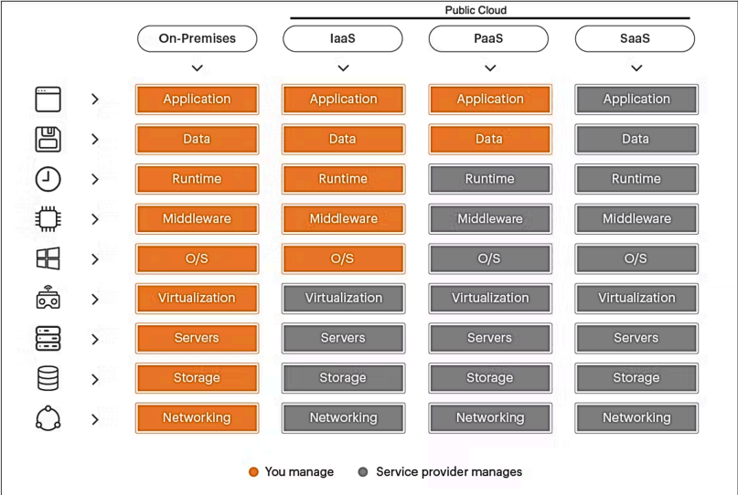

# Aviatrix Review

## Cloud vs. On-Prem
### Characteristics
**Location & Ownership**:
- On-Prem: managed by organization
- Cloud: managed by CSP

**Infrastructure Control**:
- On-Prem: Full Control
- Cloud: CSP oversee & administer the underlying infrastructure encompassing servers, networking, storage

**Expenditure**:
- On-Prem -> Capital Expenditure
- Cloud -> Operational Expenditure

**Scalability & Flexibility**:
- On-Prem: Physical Limitations. If additional resources needed, must be purchased and configured
- Cloud: Virtually limitless scalability

**Security & Compliance**:
- On-Prem: Organization manages
- Cloud: CSP manages

**Maintenance & Support**:
- On-Prem: Organization manages
- Cloud: CSP manages

## Cloud Services
**IaaS**: CSP is responsible for compute, storage, and networking services. user configures infrastructure

**PaaS**: Platform to implement code and deploying application, streamlines development process. User implements code, infrastructure is already configured
- PaaS platform is a service is where services are managed for you. You end up with a reduced level of control. For example, you can run a relational database service or platform without needing to install the underlying binaries or be responsible for hardening it or patching it or even ensuring it's uptime. You just need to bring your own code.

**SaaS**: Software is hosted by 3rd party provider, access software through web browser or app. User uses software, code is already written and hosted on 3rd parties servers

**Private Clouds:** Provisioned for exclusive use by a single organization. It should provide capabilities such as on-demand self-service, broad network access, resource pooling, rapid elasticity, and measured service. Managed internally or by a third party, or some combination of them, ideal for sensitive data handling. It may exist on or off premises.

**Public Clouds:** Operated by third-party providers, public clouds provide scalable and cost-effective cloud computing resources accessible over the internet.

**Hybrid Clouds:** These combine on-premises or private clouds with public clouds, enabling fluid data and application movement between environments. They maintain data control and security while offering scalability.

**On-prem Infrastructure:** Consists of physical and virtual resources within an organization’s own facilities, providing high security and control but requiring significant investment and ongoing maintenance.

## Benefits of Moving to the Cloud
1. Provides speed and agility to deploy applications and resources
2. Application Turnaround & Uptime
   - faster application turnaround and uptime is highly available and resilient infrastructure
3. Auto-Scaling
   - allows for resource allocation based on demand dynamically which ensures optimal performance and cost efficiency. Handles workload without manual intervention.
4. Hardware Ownership vs. Pay-as-you-go Model
    - No need to invest in and maintain physical hardware. Shifts from Capital to Operating expenses offering financial flexibility and scalability. ALIGNING COSTS WITH ACTUAL USAGE.

### Consideration
1. Urgency of DevOps
2. Networking and Security
3. On-Prem networking elements
### Design Consideration
1. Building 
2. Operations
3. Growing

## Cloud Networking
Cloud Service Provider (CSP): 3rd party company offering cloud-based platform infrastructure, application, or storage services.
- **Infrastructure**: Compute, Storage, Network
- **Identity and Access Management (IAM)**: who can do what to which resource
- **Core Services**: Compute, Storage (database), Network
**Resources**: Specific instances that you can create
**Dedicated Connectivity**: Private path connectivity from on-prem to CSP region
**Virtual Data Center**: Collection of resources you can create within a geography
**Dedicated Connectivity**: Private path connectivity from on-prem to CSP region

## Main CSP
**AWS**:
- mature ecosystem
- broad service portfolio
- Offers a wide range of cloud services, including hosting internal applications, managing large databases, implementing machine learning algorithms, and deploying IoT solutions.

**Azure**:
- significant investments in Microsoft technologies
- operating in highly regulated industries like finance or healthcare

**GCP**:
- data-driven company looking to derive insights from large datasets
- enterprises adopting containerization and microservices architecture 

**OCI**:
- Intensive computational tasks like scientific research, engineering simulations, and financial modeling
- A database service that appeals to industries requiring intensive computational tasks

**Alibaba Cloud**:
- expand operations into the Chinese market by providing cloud services tailored for local requirements, regulations, and business practices.

## Multi-Cloud Network Architecture (MCNA)

- Networking and Security in the cloud is COMPLEX and LIMITED
Lack of Architecture -> Chaos -> Non-Operational Deployments

In summary, the Aviatrix MCNA is a 3-tier architecture that comprises three layers:

- Application Layer (also known as Spoke Layer)
- Transit Core Backbone Layer
- Access Layer

Device -> Cloud Access -> Global Transit -> Application 

**Cloud Core**
-----------------------------------------------
- Application Layer: Virtual Data Centers (VPCs, VNets, VCN, etc.)
- Global Transit Layer: Intra & Inter-Cloud Networking (Performance, Scale, Availability) 
  - Unified Data Plane for single or multi-cloud

**Cloud Access**
-----------------------------------------------
- Cloud Access Layer:Cloud Ingress/Egress (Data Center, Branch, Users)
  - Where devices connect to access the cloud

**Cloud Security**
-----------------------------------------------
Secure Everything: Ingress and Egress, Access Control, Encryption, and Segmentation Firewalls

**Cloud Operations**
-----------------------------------------------
Global Visibility, Control & Automation: Day 1/2/3 Ops, move-add,change, troubleshooting, terraform

**Benefits of MCNA Approach**
-----------------------------------------------
- Normalized Data Plane
- Repeatable - Pod-like Architecture
- Flexible and Modular Design
- Embrace and Extend
- Security embedded at each layer
- Day 2 Ops ready

## CSP Limitation
Limited Networking
1. Bandwidth Constraints
2. Higher Costs if exceeding bandwidth limits
3. Lack of Advanced Networking Features 

Solutions to common CSP limitations
- Scalability
- Security
- Efficiency

CSP Mistakes
1. Cloud Provider Lock-In
2. Lack of Interoperability
3. Data Gravity and Transfer Costs

**By proactively addressing the opportunities of cloud provider lock-in, organizations can maintain agility, minimize risk, and optimize their cloud deployments for long-term success.**

Security Concerns
1. Limited Security Controls
2. Data Privacy and Compliance
3. Identity and Access Management (IAM)

Considerations in Building Consistent Network
1. Lack of Interoperability
2. Complex Configuration Management 
3. Visibility and Monitoring Challenges

**By leveraging best practices and adopting innovative technologies, organizations can overcome the complexities of multicloud networking and establish robust, scalable, and resilient network infrastructures.**

CSP Considerations
1. Downtime & Availability
2. Vendor Lock-In
3. Security & Compliance
4. Cost Predictability

Summary
Challenges in a MCNA:
- securing data transfer
- addressing skill gaps
- ensuring visibility and control
- managing day-to-day operations
- optimizing costs

## Cloud Security
Securing Cloud Environment
1. Cloud Environment
   - Cloud computing operates in a distributed manner, spanning across multiple geographical locations. Unlike traditional on-premises setups, cloud environments are not confined to a centralized infrastructure but are spread across various data centers and regions globally.
2.  Zero Trust Model
    - The Zero Trust Cloud Security model challenges traditional trust assumptions by adopting a strict "trust no one" stance. Under this model, every user, device, or component is considered untrusted by default, regardless of their location within or outside the network. This approach ensures that all resource access requests are thoroughly inspected, authenticated, and verified before granting access. Ultimately, how ZTM works is simple: **deny everyone and everything access to a resource unless it is explicitly allowed**.
3.  Dynamic Nature of Cloud
   - Cloud environments exhibit dynamic characteristics, such as ephemeral IP addresses and subnets, especially with the rise of containerized workloads like Kubernetes. In such dynamic landscapes, traditional identification methods based solely on IP addresses become less meaningful. Instead, attribute-based security practices, such as tagging, labeling, and resource identification, play a crucial role in enhancing security posture and risk mitigation.
4.  Distributed Security Deployment
   - Recognizing the distributed nature of cloud environments, security measures must be deployed closer to the workloads, applications, and data they protect. Adopting a distributed security approach ensures that security controls are strategically placed at entry and exit points, enhancing overall protection and threat detection capabilities.
5.  Attribute-Based Security
   - In cloud security, attribute-based practices are essential for adapting to the dynamic nature of cloud environments. Tagging, labeling, and resource identification based on attributes other than IP addresses enable organizations to implement more granular access controls and effectively manage security policies across diverse cloud resources and services.

NAT Gateway
**Limitations of NAT**
Unfortunately, NAT, while efficient for address conservation, lacks granularity in access control. It operates in a broad manner, limiting the implementation of fine-grained access control policies. This all-or-none approach can pose challenges in enforcing strict security measures.

Proxy-Type Services
In the realm of network security, organizations often explore various solutions to enhance their infrastructure's resilience against external threats. One such solution is the utilization of proxy-type services like Squid. While Squid offers benefits such as improved response times through caching frequently-requested web pages, it also presents challenges related to management and visibility.

**In Summary**
Understanding the limitations of traditional solutions like NAT in modern security paradigms is crucial for organizations. By supplementing NAT with additional security layers and exploring alternatives like Squid proxy-type services, organizations can enhance network security effectively. This knowledge empowers organizations to fortify their defense mechanisms and safeguard network infrastructure against evolving security threats.

Further Considerations of Centralized Firewalls in the Cloud
- Latency and Performance
  - Centralized firewalls become bottlenecks due to increased traffic volume. All traffic must traverse the central point, affecting latency and overall performance. This bottleneck can lead to delays in data transmission and response times, impacting user experience and productivity.
- Risk of Attacks
  - Routing traffic from one VPC/VNET to another exposes it to potential threats. Attacks can propagate across the network, exploiting vulnerabilities in the centralized firewall or compromising traffic integrity during transit. This increases the risk of unauthorized access, data breaches, and other security incidents.
- Cost and Scalability
  - Centralized firewalls require additional hardware to handle the load, incurring costs. Egress charges apply even if traffic is blocked at the VPC/VNET level, contributing to operational expenses. Moreover, as network traffic grows or changes, scaling centralized firewalls to accommodate increased demand becomes complex and costly, posing scalability challenges for organizations.

Centralized architecture:

Distributed architecture

New Possibilities for Enhanced Security
In the ever-evolving landscape of cloud security, new possibilities are emerging, offering enhanced protection while optimizing costs and streamlining processes. Let's explore some of these exciting developments:

**Optimizing Cost:**
- Traditionally, cloud storage companies incurred high costs during peak months. However, with the flexibility and elasticity of cloud resources, there's now the possibility of reducing overall expenses. By dynamically scaling resources based on demand, organizations can optimize costs by scaling down during off-peak periods. This flexible approach ensures efficient resource allocation and cost optimization without compromising performance.

**Automation:**
- Increasing efficiency and agility, automation streamlines security policy creation based on tags rather than traditional IP-centric approaches. This dynamic policy implementation accelerates time-to-market, enhancing operational agility and adaptability. By automating security policies, organizations can respond rapidly to evolving threats and business needs, ensuring robust protection while maintaining agility.

**Enhanced Security Architecture:**
- Cloud security advancements hold significant promise, yet effective security hinges on meticulous design and architecture. A well-crafted security framework not only boosts resilience but also curtails vulnerabilities and upholds regulatory compliance. By adopting a holistic design strategy encompassing scalability, data integrity, and access controls, organizations forge robust security infrastructures resilient against evolving threats.

In conclusion 
The evolving security landscape in the cloud offers organizations exciting opportunities to enhance defenses, optimize costs, and drive innovation. Embracing these advancements and implementing robust security practices enable businesses to stay ahead of threats and protect their digital assets effectively

## Aviatrix Cloud Networking Platform
Aviatrix Cloud Networking Platform enhances:
- Visibility 
  - CoPilot
    - Deep Visibility & Troubleshooting 
      - Aviatrix CoPilot offers visibility through its NetFlow data from each gateway within the  system, health status, and topology information
      - Aviatrix delivers enterprise-grade visibility tools via its CoPilot interface. Each gateway within the system gathers crucial NetFlow data, health status, and topology information, which is then centralized in CoPilot, enhancing troubleshooting and network analysis.
    - Day 2 Operations
      - CoPilot allows managing system easier Aviatrix streamlines the daily management of your multicloud network. Utilizing CoPilot, you can effortlessly oversee, monitor, and troubleshoot complex network configurations, simplifying operational demands and enhancing network reliability.
      - 
- Control 
  - Controller
    - Multi-Cloud Agility & Control
      - Aviatrix offers network agility through automation using Terraform
      - Aviatrix fosters network agility through consistent automation using Terraform, allowing you to design and build architectures across any cloud region. You can rely on Aviatrix to maintain consistent security policies throughout all cloud environments, ensuring a secure and compliant network operation.
- Performance
- Multi-Cloud Network Architecture
  - Embedded Security
    - Security is deeply integrated into every layer of your Aviatrix network. Leveraging high-performance encryption (HPE), Aviatrix ensures that you are not limited by the throughput restrictions of standard IPSec connections. This capability allows you to build secure, encrypted transit connections between CSPs and regions, mitigating the complexity and latency typically associated with direct connections.
  - Network Segmentation
    - Network Segmentation provides granular control establishing clear boundaries between segments enhancing protection of sensitive data and critical applications by restricting access and minimizing the lateral movement of potential threats
    - Aviatrix Network Segmentation provides detailed, granular control, facilitating the precise separation of resources across cloud, multicloud, and on-premise environments. This capability is essential for bolstering security by creating distinct, secure zones within your network infrastructure. It effectively establishes clear boundaries between these segments, which enhances the protection of sensitive data and critical applications by restricting access and minimizing the lateral movement of potential threats.
    - Aviatrix's interface simplifies configuration and complex segmentation. The intuitive interface of Aviatrix simplifies the configuration of complex segmentation policies. This user-friendly setup allows IT teams to quickly adapt and respond to evolving security requirements and threat landscapes. Additionally, Aviatrix’s segmentation tools offer the flexibility needed to accommodate changes in network configuration and security policies without disrupting existing operations, ensuring a secure, resilient, and adaptable network environment.

Simplified MCNA:

In summary, the Aviatrix MCNA is a **3-tier** architecture that comprises three layers:

1) **Application Layer** (also known as **Spoke** Layer)
2) **Transit Core Backbone Layer**
3) **Access Layer**
- MCNA -> segmented & secure network

Multi-Cloud Agility & Control

Aviatrix System uses Software-Defined Networking (SDN)

Controller & CoPilot platforms while distributing data operations across Aviatrix Gateways.

**Aviatrix Controller**: Central hub for Multi-Cloud Network Architecture using its control plane logic to manage single/multi-cloud networks.
- Controls
  - Functions as a Centralized Control Plane by filling up the routing tables of the Aviatrix Gateways
- Orchestrates
  - Acts as a Centralized Orchestration Plane by orchestrating, for instance, an Application Load Balancer in front of a fleet of Aviatrix VPN Gateways
- Automates
  - Serves as a Centralized Automation Plane by ingesting any Terraform manifests.

- CoPilot
  - Aviatrix CoPilot™ serves as the sophisticated **management interface** for the Aviatrix Cloud Networking Platform, enhancing visibility across complex, multi-cloud networks controlled by the Aviatrix Controller.
    - visualizes for operations, security, insight on cost through resource utilization
    - data plane channels logs, NetFlow data, visibility, telemetry and control plan traffic to CoPilot
    - Gain the ability to configure, manage, automate, & operate all network connections, security policies, and monitor all gateways & traffic across network though UI, API, or Terraform

- Gateways

The Distributed Data Plane facilitated by Aviatrix Gateways, plays a crucial role in enhancing the functionality and security of cloud networks. This component is responsible for constructing a secure overlay network that seamlessly integrates with underlying cloud service provider (CSP) infrastructures.

1. Architecture and Deployment
Aviatrix Gateways form the backbone of the distributed data plane, creating a cohesive network overlay that extends across various CSP environments. This overlay network is designed to facilitate smooth and secure communication between disparate cloud services, effectively bridging the gaps between different cloud providers.

1. Secure Overlay Network
The overlay network established by the Aviatrix Gateways ensures that all data transmitted across the system is securely encapsulated. This approach minimizes exposure to external threats and vulnerabilities commonly found in public internet connections. It leverages advanced encryption standards to protect data in transit, providing an additional layer of security that fortifies the entire network.

1. Integration with Data Centers
The Aviatrix distributed data plane can be seamlessly integrated with traditional data centers, which often serve as the backbone for many enterprise IT infrastructures. By extending the secure overlay network to include data centers, Aviatrix facilitates a smoother transition and synergy between cloud-based resources and on-premises systems.

This integration helps to ensure on-premises systems and cloud-native environments work together harmoniously, providing a cohesive and secure network infrastructure.

4. Partnership with Equinix
Equinix, a global leader in data center and colocation services, plays a pivotal role in enhancing the capabilities of the Aviatrix solution. By deploying Aviatrix Gateways within Equinix locations, organizations can benefit from reduced latency and increased connectivity options. Equinix’s extensive global footprint allows Aviatrix users to deploy a truly distributed architecture that is both scalable and high-performing, ideal for enterprises aiming to expand their operations globally without compromising on network performance or security.