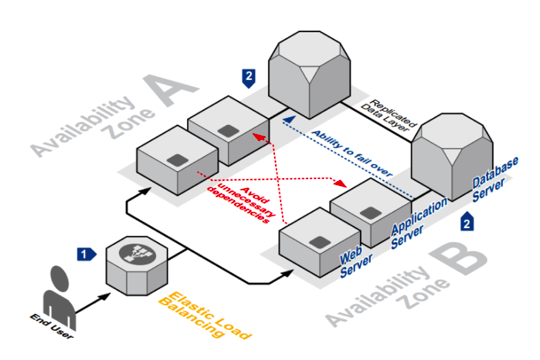
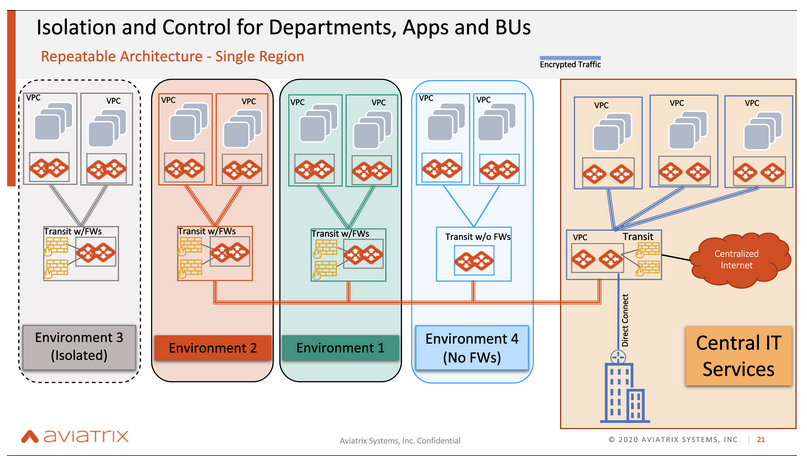

# ACE Associate Exam Review
## About Aviatrix
Aviatrix software provides a platform for companies to build networking and security infrastructure in the public cloud. The platform provides architecture applicable to both single and multiple public cloud deployments. Currently, the software supports public clouds such as AWS, Azure, GCP, and OCI.
- pioneer of Multi-Cloud Network Architecture (MCNA)

MCNA is unlike any other architecture because it embraces, controls, and manages not only the native cloud constructs but also provides advanced services beyond what the Cloud Services Providers (AWS, Azure, GCP, OCI and Alibaba Cloud) can provide. It provides a consistent and repeatable architecture across multiple clouds, being the first in the industry to do so, making it an essential part of the present and future of the public cloud.

## Public Networking
### Intro to Public Cloud and Cloud Networking
***Public cloud***:
This is a data center managed by a Cloud Service Provider, such as AWS, Azure, GCP, or OCI. The public cloud is a shared infrastructure running thousands of clients. While this allows CSPs to get their services to the most amount of people, this can also open up potential security concerns.

***On-Prem DC***:
Although the public cloud is gaining popularity, on-prem data centers still exist. These on-prem data centers are typically for only one client, and are managed by the client themselves. Because of this, on-prem data centers are very secure.

***Private Cloud***:
The private cloud is a data center with a software defined layer, essentially mimicking the public cloud. However, there are lots of differences between the public cloud and the private cloud, because although some basic features overlap, such as the use of automation, the services in the private cloud fall behind those of the public cloud.

The public cloud provides many advanced services in the IoT space, the container space, and in so many more aspects.

The private cloud has more similarities between the on-prem DC than the public cloud. 

***How Networking Works in the Public Cloud***:
1. The CSP’s pick a region to build their DC.
2. Next, they pick an Availability Zone located in the region.
3. The AZ’s hold the actual, physical data centers.
   1. This prevents issues because there are multiple data centers, so one can take over if another has a problem.

### Cloud Fundamentals
***On-Prem Networks***:
- Follow an architecture 
- On Prem was slow/applications needed to be deployed faster 
- DevOps moved to cloud 

***Reinventing Network and Security Architecture for Cloud***:
- VMware was able to virtualize servers, and run applications on a virtual machine, however this was still On Prem 
- People moved to public cloud but there was an architectural gap 
- Aviatrix provides the architecture, MCNA, to help deploy applications  

**IaaS, PaaS, SaaS**:
*On Prem (physical/virtual)* 
- Underlay, hardware, software, day0, day1 and day 2, everything is the user’s responsibility 

*Infrastructure as a Service*
- CSP’s manage hardware, software, storage, and networking 
- Users are responsible for running the virtual machines and patching the O/S 

*Platform as a Service*
- Users only consume as a platform 
- CSP’s manage everything, you only manage applications and data 

*Software as a Service *
- Users consume the service 
- All aspects managed by CSP’s 

***What is Hybrid Cloud?***
- Cloud connectivity with On-Prem DC 

***Public Cloud Basics***
- Known to be resilient, highly available, multiple regions 
- Just as data centers have issues, the CSP’s data centers have issues as well 
- Users however have no control/visibility of these issues 

*Data Center*
- Cloud service providers use data centers to house cloud services and cloud-based resources 

*Region* 
- Data centers are grouped in regions and geographic areas to provide regional service availability 

*Availability Zone*
- Distinct locations within the cloud provider’s network that are engineered to be isolated from failures  

***Public Cloud Network vs. On-Prem DC***
- Public Cloud Network tries to provide the same services as the On-Prem DC 
- Provides concept of VPC (virtual private cloud) 
- The most important part of the VPC is the application/virtual machine 
- Virtual machines are sitting on different subnets, so they need a routing entity 
- Some security constructs are provided but are often very primitive 
- VPC required connectivity to internet (sends traffic to internet) 
- Users coming in/trying to get access to virtual machines 
- Private link to connect to data center needed 
- Limitations:
  - 100 BGP route limit in AWS-TGW 
  - No routing controls 
  - No service insertion 
  - Poor visibility 

## Amazon AWS Networking Introduction

## Microsoft Azure Networking Introduction

## Google GCP Networking Introduction

## Oracle OCI Networking Introduction

## Alibaba Cloud Networking Introduction

## Multi-Cloud Network Architecture
### Multi-Cloud Network Architecture (MCNA)
Aviatrix creates a purpose-built Multi-Cloud Network Architecture (MCNA) by implementing a data plane through dynamic and software-defined routing with a centralized control plane. Security is built into the network architecture through segmentation, encryption, ingress and egress filtering, and security services insertion. Aviatrix also leverages orchestrating cloud-native constructs, where necessary, in building and controlling the enterprise network and life-cycle management of the overall architecture. 

The architecture is valid for single-cloud-single-region, single-cloud-multiple-regions, or multiple-clouds-multiple-regions and can be easily referenced by both green and brownfield businesses with no issues. This is a common and repeatable architecture across multiple clouds, which creates simplicity and abstraction for the users by hiding all the underlying complexities and limitations of Cloud Service Providers. Because this architecture functions as a reference, it is vendor-agnostic. 

MCNA architecture defines four distinct layers at a high level. These are Cloud Core, Cloud Security, Cloud Access, and Cloud Operations.

***Cloud Core:***
The cloud core of the multi-cloud network architecture goes beyond simple connectivity. It scales and supports the rapid evolution of applications and businesses. It also delivers a common data plane by supporting native cloud constructs, APIs, and adds advanced capabilities to form a common data plane with the visibility and control required to optimize the multi-cloud network. Within the cloud core, there are two subdivisions: The applications layer and the global transit layer.

***The Applications Layer:***
This is where the applications are. These applications could be sitting in VPC/VNET and running as instances or VMs. The Aviatrix controller embraces the native constructs of the cloud from this layer. This is the area where applications are deployed using their respective operating systems. 
 
***The Global Transit Layer***:
Aviatrix software enables enterprise IT to easily deploy a high-availability, multi-cloud network data plane with end-to-end encryption, high-performance encryption, multi-cloud security domains, and operational telemetry operations teams need. This is the main point of connection for every aspect of the cloud. This global transit layer also has the notion of inserting services in its platform, which is done through the service insertion framework.  
 
***Cloud Security***:
Cloud security is a crucial part of the MCN architecture. This layer encompasses all the other layers of the cloud. It ensures that all the areas in the cloud, such as the applications, transit, and access layer are secure. The MCNA model enforces cloud security in many aspects, such as when connecting cloud to on-premise, ingress, egress, and security within the cloud security with encryption and security segmentation. 
 
***Cloud Access***:
The multi-cloud access layer is a crucial layer of the multi-cloud network when interconnecting to on-premise resources. This layer ensures that the cloud is securely accessible by all the components of a business. This architecture sets the multi-cloud foundation by securely bringing employees, partners, customers, branch offices, and legacy data centers into the cloud as one cohesive unit.
 
***Cloud Operations***:
This layer provides full visibility for all aspects of the cloud, meaning that it encompasses each layer. It is a centralized operations plane. This is also the layer of the cloud that encompasses the most crucial tools, such as troubleshooting, visibility, and automation. 

MCNA showcases a centralized controller to manage single or multiple clouds with a global, distributed, unified and normalized data plane. 

#### Video

### Transit Networking
The cloud providers allow VNet Peering when it comes to native VPCs or the VNet, which leads to problems with scale, as this model promotes a full mesh structure. This is because the VPC’s are not transitive, and thus leads to more complexities and difficulties when managing and updating the routes. Ultimately, there is no network correctness.

Currently, only AWS and Azure have transit solutions, and even those come with a handful of limitations.

***In AWS***

AWS provides the AWS Transit Gateway as its solution. There is a lack of visibility as users are not able to log into the software and control the security or even create two TGW’s in one region.

***In Azure***

Azure has multiple transit solutions, such as the ER Edge Router, the Azure Firewall, and the Virtual WAN, but each solution has its own specific limitations as well, such as a lack of visibility.

***Non-Aviatrix 3rd Party Transit Network solutions***

Despite there being other 3rd party transit network solutions on the market, such as Cisco and Palo Alto Networks, none of them come close to making transitive routing easier.

Users must manage the IPSec Tunnel with a throughput dependent on 1.25GBps per tunnel. Furthermore, instance sizes are not in the enterprise’s control and the BGP must also be managed by the user. All of these additional burdens just continue to increase the complexities and decrease the network correctness.

***Characteristics of Aviatrix Transit Architecture***

Similar to a house, the foundation of this architecture must be secure and strong. This means that the architecture must be well rounded, secure and encrypted, and centrally managed.

  1. The Aviatrix controller manages the interactions and builds the transit in a matter of minutes.
  2. This transit can be made throughout all CSPs.
  3. Enterprises can use CoPilot to get the maximum visibility in one centralized area.

***BGP Route Appoval is an example of Network Correctness***

This feature allows users to approve any BGP-learned route from on-prem into the cloud network. 

## Aviatrix Platform Features
### Platform
***A Centralized Controller***: Aviatrix offers a centralized controller to make complex networking easy and does not require any background knowledge of networking command-line interfaces.

This controller is also the entry-point for multi-cloud automation, which can be done using Application Programming Interface or Terraform.

It is a browser-based, point-and-click management console that orchestrates both native (AWS, Azure, GCP, and OCI) constructs and advanced services from Aviatrix. This centralized controller also deploys Aviatrix Gateway instances for multi-cloud, on-premise, and edge connectivity.
 
***A Distributed and Common Data-Plane***: The Aviatrix platform embraces native cloud constructs and extends the functionality using advanced networking and security, which are both provided by Aviatrix Controller and Gateways.

The Aviatrix gateways can be considered as service nodes, providing a robust and common data-plane within a Cloud or across multiple Clouds.

As part of the data-plane, these gateways work to provide services such as transit routing, high-performance encryption, egress and ingress control, edge connectivity, on-premise connectivity, and user-VPN services.

 
***Operational Visibility***: CoPilot, one of Aviatrix's many services, allows users to have full operational visibility in their network, all while informing them of any issues in their cloud network.
 
***Multiple Accounts and Clouds***: Aviatrix is also able to integrate multiple accounts and clouds seamlessly and on one single interface. This allows customers to interconnect AWS, Azure, and Google Cloud with the same point and click flow.
 
***Security & Compliance***: To help its service run smoothly, Aviatrix provides many security and compliance measures. It allows users to manage security domains, such as the Development domain and the Production domain, and also allows for Virtual Private Cloud connectivity through Connection Policies. Users are able to easily apply firewall filters based on tags or specific address ranges, CIDR, protocols, and ports.

Aviatrix services are also integrated with AWS GuardDuty to block malicious activity automatically at the Virtual Private Cloud network level.

### Overview
**Aviatrix Platform Components**
*Aviatrix Controller*
- Your instance- you use, keep, and manage 
- Management, orchestration, and control plane 

*Aviatrix Gateways*
- Provides normalized data plane 

*Native Cloud Constructs*
- Control plane allows management of native cloud constructs 
- If they fall short, Aviatrix can provide advanced network and security capabilities through gateways 

*Aviatrix Controller*
- Only one Aviatrix controller is needed across all clouds 
- Separate licensing agreement with Aviatrix is not needed 
- Controller can be launched from any cloud provider’s marketplace 
- Cloud provider credits can be used  

*Core Features*
- Controller
  - Provides intelligent orchestration & control 
  - Multi account / Multi subscription 
- Advanced Networking Multi-Region and Multi-Cloud  
- High Performance Encryption  
  - In the cloud  
  - With on-prem DC using cloud hardware appliance 
- Site to Cloud/ On-Prem 
- CloudWAN 
- Smart SAML User VPN 
- Secure Egress and Ingress 
- Firewall Network (FireNet) 
- Operational Tools 
  - Ex: Flight Path, Packet Capture, Trace Route, etc. 

*Licensing options*
 - Pay as you go 
 - Bring your own license  

### Cloud Security

#### High Performance Encryption

 A typical data center or cloud deployment can be divided into different planes. For an enterprise, using AWS Direct Connect and Azure Express Route works to connect the data center to the cloud without encryption. To encrypt this connection, users have the option to create an IPSec Tunnel which limits the throughput to only 1.25Gbps. This is a problem in cases where the customer purchases a 10G Direct Connect Circuit/ExpressRoute, but is only able to utilize 1.25Gbps of it, which is immensely smaller than it should be.

Aviatrix has a method of encryption without the limitations of the IPSec Tunnel, called High Performance Encryption. HPE is able to accomplish this by utilizing all the CPU cores, which achieves line rate encryption throughput.

This HPE is integrated into the Transit Network solution by building a high performance encryption tunnel over private network links. 

#### Firewall Network Services - FireNet
After onloading any meaningful workload on the cloud, the Security Policy mandates that the traffic going to and from the workload is inspected using a Firewall because the layer four security groups are not enough to pass the audit. The traffic needing inspection could be East-West or North-South.

Aviatrix provides a solution that allows enterprises to apply the firewall in any possible area or direction.

- In VPCs/VNets inside a cloud.
- If the traffic is going towards the Internet (Egress).
- If the traffic is coming from the Internet (Ingress).
- Traffic coming in from the Data Center.
- Any branch and partner site connected to the cloud.
- The traffic sent to another cloud.

This solution is unique because there are many problems that come with inserting firewalls in Cloud Networks:

  1. The Firewall Vendors typically provide the firewalls but the customer is responsible for managing and routing the traffic to the firewalls themselves and managing it through and through.
  2. The Cloud Providers often don’t have L7 Firewalls, and if they do, the features are limited in terms of those required for an enterprise. Similar to the solutions provided by the Firewall Vendors, the customer is responsible for routing the traffic to the firewalls themselves and managing it through and through.

***The Azure Native Solution***

Azure has a native firewall, but the problem is that when users want to send the traffic from one spoke VNET to another, they must make sure the UDR’s are done properly so that it can point to the VIP of the load balancer correctly, go into the Firewall, and then to the destination. Furthermore, when running in Active Active mode, they must also deploy the SNAT so that the return traffic doesn’t hit the wrong firewall. Essentially, manual configuration is required and it takes high complexity to manage changes in Azure. The same challenges can be seen in a 3rd party firewall solution, with the additional challenge of having to configure the SNAT as well. 

***The AWS Native Solutions***

*The VPC Attachment Model*

One of the problems with AWS’s Native Solution is that the Active Standby can only be deployed in one AZ, even though the solution is quite expensive with only one VM-Series being active.

Because AWS has a TGW, it is possible to attach to the VPC to get more throughput. However, all of these routing tables also have to be manually configured so that the traffic can go where it needs to be.

*The IPSec VPN Model*

In this model, the IPSec Tunnel is built towards the Firewall, giving users 1.25Gbps throughput, which effectively gives users about 600MBps because it has to go back on the same VPN link. The throughput will reduce as more advanced features are used. Source NAT is another challenge. 

***Aviatrix Transit FireNet Solutions***

Aviatrix solves for the shortcomings of the native solutions provided by the CSPs by deploying the firewalls into the Transit VPC. This helps to utilize the full performance of the firewalls, simplifies the management of all the networking elements because Aviatrix takes care of it, and allows enterprises to scale with ease and no compromise in visibility.

This architecture consists of Active Active Gateways in an active mesh, and also provides a scale up option. This solution has a throughput of 70 Gbps, compared to the AWS TGW throughput of 1.25Gbps.

***Aviatrix AWS TGW FireNet***

When deploying the Aviatrix solution with the AWS TGW, all users have to do is attach the Transit VPC to the AWS TGW.

This automatically sends the traffic to the Fire Wall without any additional components, such as an IPSec tunnel, or a SNAT. This also doesn’t require a BGP.

Some benefits of this approach compared to the native one include the maintenance of the session stickiness, load balancing provided by Aviatrix, and integration with Panorama. 

***Aviatrix Security Domain***

This allows enterprises to create policies and then implement network segmentation. For example, users can put all their production workloads in one production domain and all their developer workloads in another developer domain. This will allow the enterprise to disable traffic between the two domains, or set security policies to manage the communication. 

***Aviatrix Azure Native Peering FireNet***

The Aviatrix FireNet Solution works in Azure almost exactly how it works in AWS, with the only difference being that there will be no encryption without the Aviatrix Gateways in the Spoke VNets. 

***Single/Multi-Region Multi-Cloud Aviatrix Transit FireNet***

It is very easy to connect different business units with varying requirements within a single region. For example, if an environment doesn’t require a FireWall while the others need one, that is possible. Similarly, it is possible to have an environment that is isolated within the business unit. In a multi-region, this is still possible. 

#### Egress Security
 Because Workloads require Internet access, it is essential to keep the rest of the cloud secure when these applications and instances/VMs pull this information from the Internet. A NAT Gateway is supposed to perform this task safely and efficiently. However, this gateway has limitations because it only allows enterprises to configure rules based on the IP (Source, destination, port, and protocol). There is no way to write rules based on the URL or FQDN instead.

Aviatrix provides the FQDN Egress Filter service to make writing rules based on the URL or FQDN possible. 

***Fully Qualified Domain Name (FQDN) Egress Filter***

1. Go on Controller
2. Create profiles
3. Create rules
4. Push it to the gateways that you want to have access to the Internet

This can be used on public or private subnets to get the enhanced security that the cloud needs. This works by replacing the NAT Gateway with an Aviatrix Gateway inside of the VPC. 

***Ingress Security (Guard Duty + VPC Ingress Routing)***

The AWS GuardDuty is one example of a service that provides ingress security. It is a threat detection service that uses a database to detect malicious IP addresses. However, this service doesn’t take any action on the malicious activity that it finds.

The Aviatrix Guard Duty Enforcement service extends the capabilities of AWS GuardDuty by taking the information from AWS GuardDuty and then automatically triggering the controller into blocking the IP Address, thus contributing to an updated filtering table. Simply, the AWS GuardDuty service is an intrusion detection service, while the Aviatrix Guard Duty Enforcement service is an intrusion prevention service. 

### Cloud Access
#### User VPN VoD
Connecting remote users to data center locations and being able to connect to corporate resources through a VPN is essential, especially in today’s day and age. 

User VPN Features: 

- Connects users to public cloud resources 
- No need to backhaul to On-Prem DC first 
- Least latency accessing the cloud resources 

In the smart SAML VPN architecture, you deploy a VPC, or VNET in the cloud access layer. From there you enter the transit network, and then based on the routing you have, the destination can be reached.  

 This solution is profile based. The partners, contractors, and employees have their own profiles and go to only their respective VPC’s/VNETS. Aviatrix provides isolation amongst the personas. This solution also allows connection to different Enterprise Identity Provider (IDP). The security rules apply automatically when the user is active but otherwise are removed from the gateway. The solution also supports both split and full tunnel modes. Furthermore, we provide a client for authentication with IDP, but any OpenVPN client is also supported.   

#### Site2Cloud VoD

## Operations, Visibility, and Troubleshooting

## Technology Partner Integrations

### Cloud Partners
·        Amazon Web Services
·        Microsoft Azure
·        Google Cloud Platform
·        Oracle Cloud Infrastructure
·        Hashicorp

### Technology Integration Partners
·        Splunk
·        Palo Alto Networks
·        Terraform by HashiCorp
·        Check Point
·        Okta
·        Megaport
·        DataDog
·        Centrify
·        Duo Security
·        Ansible
·        SignalFx
·        Fortinet