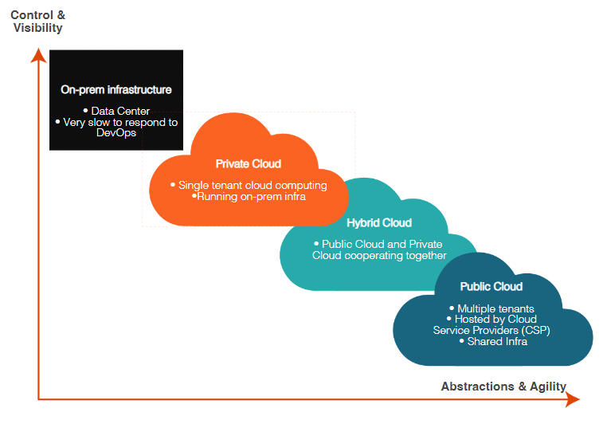

# Aviatrix Review

## Cloud vs. On-Prem
### Characteristics
**Location & Ownership**:
- On-Prem: managed by organization
- Cloud: managed by CSP

**Infrastructure Control**:
- On-Prem: Full Control
- Cloud: CSP oversee & administer the underlying infrastructure encompassing servers, networking, storage

**Expenditure**:
- On-Prem -> Capital Expenditure
- Cloud -> Operational Expenditure

**Scalability & Flexibility**:
- On-Prem: Physical Limitations. If additional resources needed, must be purchased and configured
- Cloud: Virtually limitless scalability

**Security & Compliance**:
- On-Prem: Organization manages
- Cloud: CSP manages

**Maintenance & Support**:
- On-Prem: Organization manages
- Cloud: CSP manages

## Cloud Services
**IaaS**: CSP is responsible for compute, storage, and networking services. user configures infrastructure

**PaaS**: Platform to implement code and deploying application, streamlines development process. User implements code, infrastructure is already configured
- PaaS platform is a service is where services are managed for you. You end up with a reduced level of control. For example, you can run a relational database service or platform without needing to install the underlying binaries or be responsible for hardening it or patching it or even ensuring it's uptime. You just need to bring your own code.

**SaaS**: Software is hosted by 3rd party provider, access software through web browser or app. User uses software, code is already written and hosted on 3rd parties servers

**Private Clouds:** Provisioned for exclusive use by a single organization. It should provide capabilities such as on-demand self-service, broad network access, resource pooling, rapid elasticity, and measured service. Managed internally or by a third party, or some combination of them, ideal for sensitive data handling. It may exist on or off premises.

**Public Clouds:** Operated by third-party providers, public clouds provide scalable and cost-effective cloud computing resources accessible over the internet.

**Hybrid Clouds:** These combine on-premises or private clouds with public clouds, enabling fluid data and application movement between environments. They maintain data control and security while offering scalability.

**On-prem Infrastructure:** Consists of physical and virtual resources within an organization’s own facilities, providing high security and control but requiring significant investment and ongoing maintenance.

## Benefits of Moving to the Cloud
1. Provides speed and agility to deploy applications and resources
2. Application Turnaround & Uptime
   - faster application turnaround and uptime is highly available and resilient infrastructure
3. Auto-Scaling
   - allows for resource allocation based on demand dynamically which ensures optimal performance and cost efficiency. Handles workload without manual intervention.
4. Hardware Ownership vs. Pay-as-you-go Model
    - No need to invest in and maintain physical hardware. Shifts from Capital to Operating expenses offering financial flexibility and scalability. ALIGNING COSTS WITH ACTUAL USAGE.

### Consideration
1. Urgency of DevOps
2. Networking and Security
3. On-Prem networking elements
### Design Consideration
1. Building 
2. Operations
3. Growing

## Cloud Networking
Cloud Service Provider (CSP): 3rd party company offering cloud-based platform infrastructure, application, or storage services.
- **Infrastructure**: Compute, Storage, Network
- **Identity and Access Management (IAM)**: who can do what to which resource
- **Core Services**: Compute, Storage (database), Network
**Resources**: Specific instances that you can create
**Dedicated Connectivity**: Private path connectivity from on-prem to CSP region
**Virtual Data Center**: Collection of resources you can create within a geography
**Dedicated Connectivity**: Private path connectivity from on-prem to CSP region

## Main CSP
**AWS**:
- mature ecosystem
- broad service portfolio
- Offers a wide range of cloud services, including hosting internal applications, managing large databases, implementing machine learning algorithms, and deploying IoT solutions.

**Azure**:
- significant investments in Microsoft technologies
- operating in highly regulated industries like finance or healthcare

**GCP**:
- data-driven company looking to derive insights from large datasets
- enterprises adopting containerization and microservices architecture 

**OCI**:
- Intensive computational tasks like scientific research, engineering simulations, and financial modeling
- A database service that appeals to industries requiring intensive computational tasks

**Alibaba Cloud**:
- expand operations into the Chinese market by providing cloud services tailored for local requirements, regulations, and business practices.

## Multi-Cloud Network Architecture (MCNA)

- Networking and Security in the cloud is COMPLEX and LIMITED
Lack of Architecture -> Chaos -> Non-Operational Deployments

Device -> Cloud Access -> Global Transit -> Application 

**Cloud Core**
-----------------------------------------------
- Application Layer: Virtual Data Centers (VPCs, VNets, VCN, etc.)
- Global Transit Layer: Intra & Inter-Cloud Networking (Performance, Scale, Availability) 
  - Unified Data Plane for single or multi-cloud

**Cloud Access**
-----------------------------------------------
- Cloud Access Layer:Cloud Ingress/Egress (Data Center, Branch, Users)
  - Where devices connect to access the cloud

**Cloud Security**
-----------------------------------------------
Secure Everything: Ingress and Egress, Access Control, Encryption, and Segmentation Firewalls

**Cloud Operations**
-----------------------------------------------
Global Visibility, Control & Automation: Day 1/2/3 Ops, move-add,change, troubleshooting, terraform

**Benefits of MCNA Approach**
-----------------------------------------------
- Normalized Data Plane
- Repeatable - Pod-like Architecture
- Flexible and Modular Design
- Embrace and Extend
- Security embedded at each layer
- Day 2 Ops ready

## CSP Limitation
Limited Networking
1. Bandwidth Constraints
2. Higher Costs if exceeding bandwidth limits
3. Lack of Advanced Networking Features 

CSP Mistakes
1. Cloud Provider Lock-In
2. Lack of Interoperability
3. Data Gravity and Transfer Costs

**By proactively addressing the opportunities of cloud provider lock-in, organizations can maintain agility, minimize risk, and optimize their cloud deployments for long-term success.**

Security Concerns
1. Limited Security Controls
2. Data Privacy and Compliance
3. Identity and Access Management (IAM)

Considerations in Building Consistent Network
1. Lack of Interoperability
2. Complex Configuration Management 
3. Visibility and Monitoring Challenges

**By leveraging best practices and adopting innovative technologies, organizations can overcome the complexities of multicloud networking and establish robust, scalable, and resilient network infrastructures.**

CSP Considerations
1. Downtime & Availability
2. Vendor Lock-In
3. Security & Compliance
4. Cost Predictability

Summary
Challenges in a MCNA:
- securing data transfer
- addressing skill gaps
- ensuring visibility and control
- managing day-to-day operations
- optimizing costs

