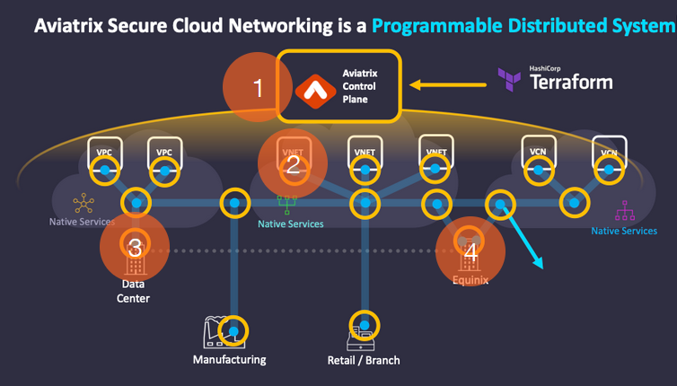
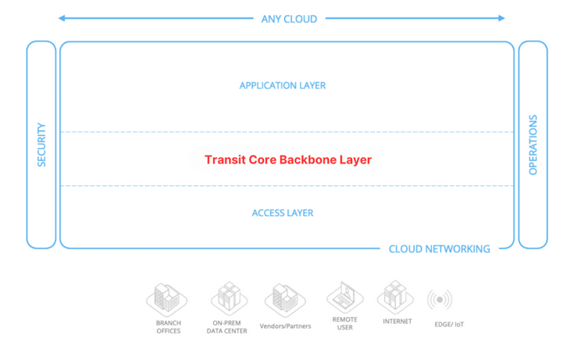
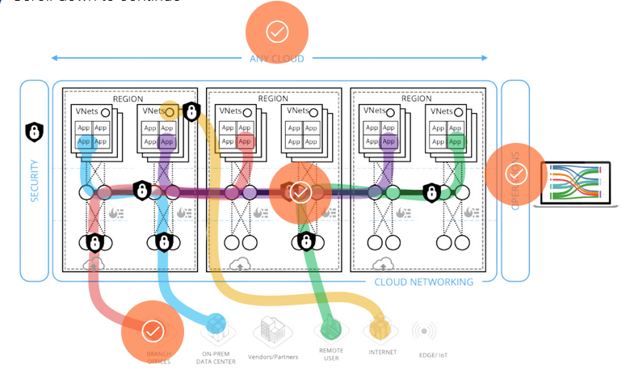
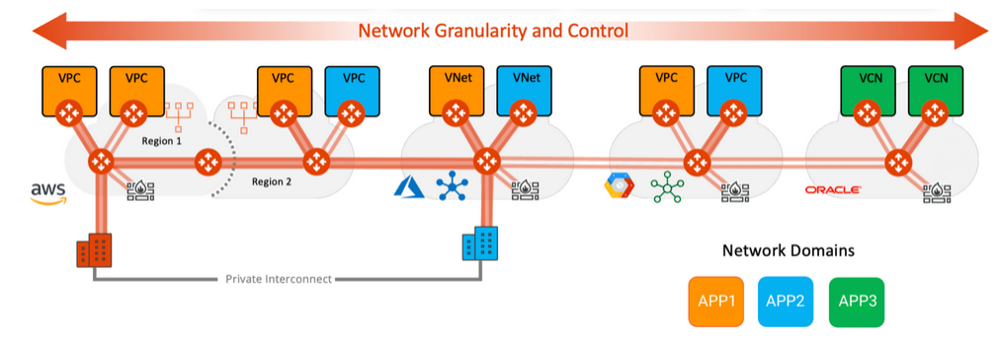
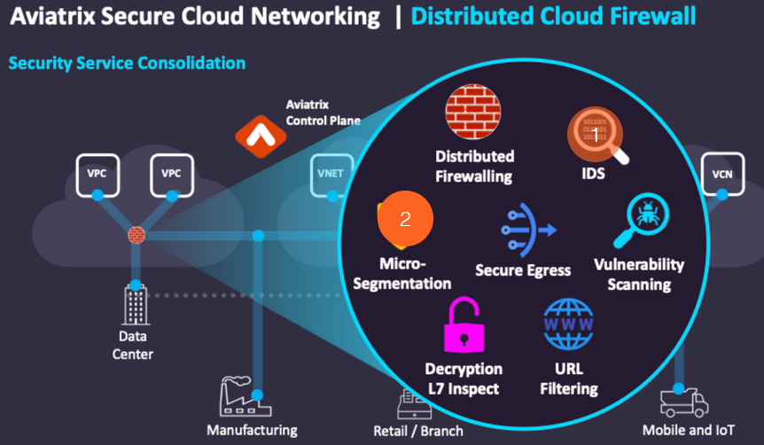
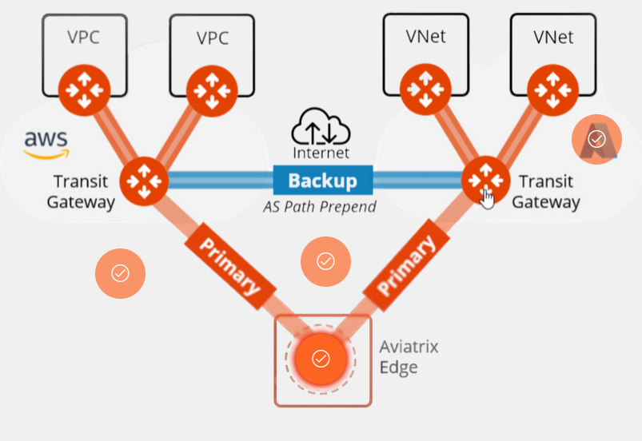
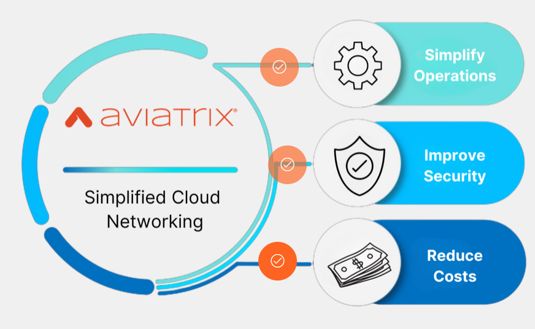

# Introduction to the Aviatrix Cloud Networking Platform

## Alternative Solutions: Harness Aviatrix for Simplified Cloud Networking
By the end of this training, you should be able to:
- Identify the solutions to common CSP limitations
- Outline best practices in cloud security
- Determine methods of cost reduction

Aviatrix addresses the fundamental considerations posed by conventional cloud service providers (CSPs) with a comprehensive platform that simplifies cloud networking, ensuring robust, secure, and efficient operations across multicloud environments.

Cloud service providers (CSPs) often encounter limitations that hinder scalability, security, and efficiency. Aviatrix addresses these challenges by offering a robust cloud networking platform that enhances visibility, control, and performance across multicloud environments. The **Aviatrix system uses a software-defined networking (SDN)** approach, centralizing control through three main software components, Controller and CoPilot platforms, while distributing data operations across Aviatrix Gateways. This structure provides a secure overlay network atop existing CSP infrastructure, ensuring high-performance encryption and comprehensive network management.

We will take a look at some of the key features and how they operate.

### Centralized Control, Orchestration, and Automation Plane
#### Aviatrix Controller
The Aviatrix Controller acts as the central hub or brain of our Multicloud Network Architecture (MCNA), using its control plane logic to seamlessly manage cloud and multicloud networks. 

**The Controller encompasses three important roles**:
- Functions as a Centralized Control Plane by filling up the routing tables of the Aviatrix Gateways
- Acts as a Centralized Orchestration Plane by orchestrating, for instance, an Application Load Balancer in front of a fleet of Aviatrix VPN Gateways
- Serves as a Centralized Automation Plane by ingesting any Terraform manifests.

#### Aviatrix CoPilot
Aviatrix CoPilot™ serves as the sophisticated **management interface** for the Aviatrix Cloud Networking Platform, enhancing visibility across complex, multicloud networks controlled by the Aviatrix Controller.

It provides a comprehensive operational view of your cloud network, crucial for supporting business-critical cloud networking operations. CoPilot empowers enterprises to implement intelligent cloud networking by embedding robust security features alongside advanced monitoring and diagnostic tools that bolster application availability. 

CoPilot delivers insights into cloud networking costs, illustrating how network resources are utilized by different business units or cost centers, which is essential for accurate billing. 
The Aviatrix data plane channels logs, NetFlow data, visibility, telemetry, and control plane traffic to Aviatrix CoPilot™, granting a unified "single pane of glass" view of your secure cloud network. With Aviatrix CoPilot, you gain the ability to configure, manage, automate, and operate all your network connections, security policies, and monitor all gateways and traffic across your network through a user-friendly interface, API, or Terraform.

### The Distributed Data Plane
The Distributed Data Plane, facilitated by Aviatrix Gateways, plays a crucial role in enhancing the functionality and security of cloud networks. This component is responsible for constructing a secure overlay network that seamlessly integrates with underlying cloud service provider (CSP) infrastructures. Let’s explore the below graphic to find out more.

1. Architecture and Deployment
Aviatrix Gateways form the backbone of the distributed data plane, creating a cohesive network overlay that extends across various CSP environments. This overlay network is designed to facilitate smooth and secure communication between disparate cloud services, effectively bridging the gaps between different cloud providers.

2. Secure Overlay Network
The overlay network established by the Aviatrix Gateways ensures that all data transmitted across the system is securely encapsulated. This approach minimizes exposure to external threats and vulnerabilities commonly found in public internet connections. It leverages advanced encryption standards to protect data in transit, providing an additional layer of security that fortifies the entire network.

3. Integration with Data Centers
The Aviatrix distributed data plane can be seamlessly integrated with traditional data centers, which often serve as the backbone for many enterprise IT infrastructures. By extending the secure overlay network to include data centers, Aviatrix facilitates a smoother transition and synergy between cloud-based resources and on-premises systems.

This integration helps to ensure on-premises systems and cloud-native environments work together harmoniously, providing a cohesive and secure network infrastructure.

4. Partnership with Equinix
Equinix, a global leader in data center and colocation services, plays a pivotal role in enhancing the capabilities of the Aviatrix solution. By deploying Aviatrix Gateways within Equinix locations, organizations can benefit from reduced latency and increased connectivity options. Equinix’s extensive global footprint allows Aviatrix users to deploy a truly distributed architecture that is both scalable and high-performing, ideal for enterprises aiming to expand their operations globally without compromising on network performance or security.

### Multicloud Network Architecture (MCNA)
Aviatrix stands as the premier company and industry leader in delivering a Multicloud Network Architecture (MCNA) through its innovative product offerings. This MCNA emerges as a trailblazing solution within the cloud computing landscape, introducing a distinctive strategy for navigating, managing, and advancing cloud networking capabilities across diverse cloud service providers.

- Architectural Foundations of MCNA
The design philosophy of Aviatrix's Multicloud Network Architecture (MCNA) is anchored in key architectural pillars: cloud core/backbone, access, application, operations, and security layers. These foundational elements ensure the creation of a robust and scalable network architecture that is specifically tailored to meet the complex demands of contemporary cloud environments.

In summary, the Aviatrix MCNA is a **3-tier** architecture that comprises three layers:

1) **Application Layer** (also known as **Spoke** Layer)
2) **Transit Core Backbone Layer**
3) **Access Layer**

- Team Segmentation and Responsibilities
MCNA provided by Aviatrix plays a crucial role in delineating clear boundaries between different teams and their respective responsibilities. This structural organization is instrumental in preventing the "flat network" issue—a prevalent problem in traditional CSP native networking setups. The segmentation highlighted as a significant challenge in Module 1 is effectively addressed by Aviatrix's strategic network design.

- Enhancing Network Management and Security
By adopting MCNA, Aviatrix empowers its customers to establish a more segmented and secure network infrastructure. This advancement significantly enhances overall network management and boosts operational efficiency, enabling organizations to maintain a more orderly and controlled network environment within the cloud.

### Simplified Multi-Cloud Networking
Aviatrix transforms your multicloud environment by providing a unified platform for managing infrastructure across various cloud providers. This approach eliminates the constraints of siloed, native cloud setups, offering a comprehensive view of your entire single or multicloud landscape through a single pane of glass.

**Deep Visibility and Troubleshooting:**
- Aviatrix CoPilot offers visibility through its NetFlow data from each gateway within the  system, health status, and topology information
- 
Aviatrix delivers enterprise-grade visibility tools via its CoPilot interface. Each gateway within the system gathers crucial NetFlow data, health status, and topology information, which is then centralized in CoPilot, enhancing troubleshooting and network analysis.

**Multi-Cloud Agility and Control:**
- Aviatrix offers network agility through automation using Terraform

Aviatrix fosters network agility through consistent automation using Terraform, allowing you to design and build architectures across any cloud region. You can rely on Aviatrix to maintain consistent security policies throughout all cloud environments, ensuring a secure and compliant network operation.

**Day 2 Operations Made Easy:**
- CoPilot allows managing system easier
Aviatrix streamlines the daily management of your multicloud network. Utilizing CoPilot, you can effortlessly oversee, monitor, and troubleshoot complex network configurations, simplifying operational demands and enhancing network reliability.

**Multi-Cloud Embedded Security:**
Security is deeply integrated into every layer of your Aviatrix network. Leveraging high-performance encryption (HPE), Aviatrix ensures that you are not limited by the throughput restrictions of standard IPSec connections. This capability allows you to build secure, encrypted transit connections between CSPs and regions, mitigating the complexity and latency typically associated with direct connections.

### **Aviatrix Solves Business Pain Points**
The Aviatrix Cloud Networking Platform addresses a wide range of business challenges for critical cloud-based applications, offering a robust suite of features to enhance network management and security. For a detailed overview of all Aviatrix capabilities, visit https://aviatrix.com to see how it can transform your cloud networking strategy.

### Network Segmentation with Aviatrix
- Network Segmentation provides granular control establishing clear boundaries between segments enhancing protection of sensitive data and critical applications by restricting access and minimizing the lateral movement of potential threats
Aviatrix Network Segmentation provides detailed, granular control, facilitating the precise separation of resources across cloud, multicloud, and on-premise environments. This capability is essential for bolstering security by creating distinct, secure zones within your network infrastructure. It effectively establishes clear boundaries between these segments, which enhances the protection of sensitive data and critical applications by restricting access and minimizing the lateral movement of potential threats.

- Aviatrix's interface simplifies configuration and complex segmentation.
The intuitive interface of Aviatrix simplifies the configuration of complex segmentation policies. This user-friendly setup allows IT teams to quickly adapt and respond to evolving security requirements and threat landscapes. Additionally, Aviatrix’s segmentation tools offer the flexibility needed to accommodate changes in network configuration and security policies without disrupting existing operations, ensuring a secure, resilient, and adaptable network environment.

### Secure Egress with Aviatrix
- Aviatrix Secure Egress Control uses policy-based zero trust model ensuring integrity and security of cloud environment.
Aviatrix Secure Egress Control leverages a stringent, policy-based zero trust model that rigorously ensures only authorized traffic to approved Fully Qualified Domain Names (FQDNs) and URLs can access your network. This meticulous control mechanism plays a critical role in safeguarding your network from unauthorized access and potential data exfiltration, thereby maintaining the integrity and security of your cloud environment. The below highlights how Aviatrix not only secures egress traffic but also simplifies management, improves security visibility, and automates compliance—key aspects that protect and enhance the operational efficiency of cloud environments.

**Automated Security Compliance:**
The Aviatrix Cloud Networking Platform automates the enforcement of stringent internet egress security policies, significantly reducing the manual effort involved in maintaining compliance. This automation ensures that all outbound traffic adheres to established security protocols and compliance requirements, minimizing the risk of breaches caused by human error or oversight.

**Enhanced Visibility and Monitoring:**
Aviatrix Secure Egress Control offers comprehensive monitoring capabilities, providing deep visibility into all egress traffic. This feature allows security teams to detect and respond to unusual traffic patterns or potential security breaches effectively. Continuous logging and detailed reports aid in forensic investigations and compliance audits, enhancing the overall security posture of your cloud environment.

**Dynamic Policy Management:**
Aviatrix enables dynamic and flexible management of egress policies, allowing your organization to swiftly adapt to changing security requirements. This adaptability is crucial as it enables administrators to update and enforce egress rules in real-time, ensuring only authorized traffic accesses the network. By providing tools to easily adjust policies, Aviatrix ensures that network access remains secure and compliant with evolving corporate and regulatory standards.

### High-Performance Encryption (HPE)
Aviatrix's High-Performance Encryption (HPE) ensures secure line rate communication for your critical infrastructure, supporting well above **50 Gbps** for cloud-to-cloud or internal cloud communication. Unlike standard IPSec tunnels, HPE achieves line-rate performance without sacrificing security. 

This is crucial for industries handling large data volumes or critical workloads. Whether for edge use cases or general network requirements, Aviatrix's HPE delivers exceptional performance and security. Let’s explore how Aviatrix ensures a secure line rate:

**Pioneering Encryption:**
- Aviatrix's High-Performance Encryption (HPE) enables 10 Gbps and higher IPsec performance, ensuring rapid data transmission without compromising security.
**Superior to IPSec:**
- Unlike traditional IPSec tunnels that can reduce performance at higher data rates, Aviatrix’s HPE maintains both high speed and security.
**Essential for Data-Intensive Industries:**
- Ideal for sectors requiring both speed and security, such as video streaming, large databases, and financial transactions.
**Benefits of HPE:**
- Offers significant advantages for handling large volumes of data, crucial for operations where time and security are critical.

### Aviatrix Distributed Cloud Firewall (DCF)
Aviatrix Distributed Cloud Firewall enhances network protection while simultaneously reducing costs and complexity. Through network micro-segmentation, you gain precise control over access to network resources and applications. Moreover, Aviatrix gateways function as firewalls, enforcing granular security policies for distributed applications across the cloud.

1. IDS
   - The platform's familiarity with native cloud constructs within its managed multicloud networks enables dynamic protection of applications as your environments evolve. Another significant advantage of this architecture is its versatility; it supports not only firewalling but also Intrusion Detection Systems (IDS), vulnerability scanning, egress URL filtering, and micro-segmentation.
2. Micro-segmentation
   - Aviatrix Micro-Segmentation also enforces security within VPCs and VNETs, leveraging AWS Security Groups and Azure NSGs. Aviatrix SmartGroup utilizes native tags, labels, and other application attributes to apply security rules. This approach crafts intent-based zero-trust security perimeters around applications (VMs, Kubernetes, Serverless, etc.), ensuring that only authorized traffic flows where it is supposed to.

### Ensuring Uniform Network Management
**Active Mesh:**
ActiveMesh dynamically adapts to current network conditions, intelligently selecting the most efficient and reliable path for data transmission. This feature enhances network management by optimizing routing decisions in real time, which reduces the need for manual intervention and maximizes network performance. Furthermore, ActiveMesh provides high availability configurations that support business continuity by ensuring network resilience and minimizing downtime, even in the event of system failures.

**Cloud Network Backbone:**
Aviatrix's cloud networking software simplifies the process of constructing a robust core network backbone. This enables seamless connections between gateways located in various regions, cloud service providers (CSPs), or data centers, thereby extending the reach of your applications to the network's edge. Additionally, Aviatrix facilitates uniform integration with CSP native objects, such as AWS Transit Gateway (TGW), Azure Virtual WAN (vWAN), Google Cloud's Global VPC, and Oracle Cloud Infrastructure's Dynamic Routing Gateways (DRG). This integration ensures consistent and secure management across your entire multicloud network, enhancing both functionality and security.

### Site2Cloud (S2C)
Aviatrix's Site2Cloud (S2C) connectivity feature bridges the gap between on-premises networks and the cloud, creating seamless connections that extend across geographic locations, business-to-business (B2B) partnerships, and beyond. This innovative feature facilitates direct and efficient communication pathways between various network environments, including those not directly managed by Aviatrix, by single advanced network technologies. S2C connectivity ensures that your enterprise can maintain robust, secure, and scalable network operations across diverse infrastructures.

**Seamless Integration Across Environments:**
S2C connectivity provides a smooth integration of your on-premises systems with cloud services. This integration allows data and applications to flow effortlessly between local data centers and cloud-based infrastructures, enhancing the flexibility and accessibility of enterprise resources. It simplifies the process of migrating to the cloud and supports hybrid cloud strategies, making it an ideal solution for organizations transitioning to cloud-first approaches while still leveraging on-prem assets.

**Advanced NAT Functionalities:**
The Aviatrix S2C feature comes equipped with advanced Network Address Translation (NAT) functionalities. These capabilities facilitate the secure extension of your cloud network to on-premises and edge locations and efficiently handle scenarios involving overlapping IP addresses. This is particularly helpful for enterprises that operate in complex network environments where IP conflicts might otherwise hinder connectivity and operations.

**Support for Diverse Network Scenarios:**
Aviatrix S2C accommodates a wide range of networking scenarios, including those involving B2B partners and remote locations. This adaptability ensures that enterprises can maintain robust connectivity even where network management extends beyond their immediate control. By supporting diverse and dynamic network configurations, S2C enables businesses to expand their operational boundaries securely and reliably.

### Aviatrix Edge
Aviatrix Edge, part of the Aviatrix Secure Edge solutions, extends cloud network architectures to on-premises environments, ensuring seamless interconnectivity and operational uniformity across cloud and on-prem landscapes. This is achieved by integrating with the Aviatrix Cloud Networking Platform, which provides centralized management and advanced network visibility.

**Hybrid Networking Support:**
Aviatrix Edge plays a crucial role in hybrid networking by connecting on-premises data centers to cloud environments. This setup facilitates the consistent management of data flow and security policies, essential for maintaining robust hybrid network architectures.

**Deployment Flexibility:**
To accommodate different deployment needs, Aviatrix Secure Edge offers various form factors, ensuring compatibility and optimal performance across environments. This includes options for edge hardware as well as virtual deployments on ESXi and KVM hypervisors.

**High-Availability Configurations:**
Aviatrix Edge is designed to support high-availability configurations, ensuring continuous service with minimal downtime. It supports various network interfaces including WAN, LAN, VLAN, and management interfaces, allowing seamless integration into diverse on-premises network setups.

**Cloud Migration and Network Extension:**
Aviatrix Edge also facilitates cloud migration and network extension by extending cloud-based configurations and security frameworks to on-premises equipment seamlessly. This capability is vital for organizations that operate both on-premises data centers and cloud environments, ensuring a smooth transition and integration between different infrastructures.

### ThreatIQ
Aviatrix ThreatIQ is a crucial component in fortifying a network's defenses against evolving global threats. Understanding how ThreatIQ operates is essential for any organization aiming to enhance its security measures and respond proactively to potential vulnerabilities.

Aviatrix ThreatIQ significantly enhances your network's security by actively protecting against the latest global security threats. It continuously updates its database with information about active threats, ensuring your network defenses are always ahead. Aviatrix ThreatIQ empowers you to automatically block newly detected threats and regions identified for malicious activity. Additionally, it enables the creation of custom threat lists and geo-blocking policies tailored to specific IP addresses or geographic regions, providing precise control over your network security.

### CostIQ
CostIQ, a prominent feature within Aviatrix's CoPilot, is crafted to enhance the management and comprehension of cloud costs. This tool is particularly valuable for organizations seeking effective ways to allocate expenses of shared cloud resources across various departments.
1. Cost Allocation Challenges
   - CostIQ tackles the complex challenge of equitably distributing the costs of shared resources such as storage or databases. These resources are often utilized by multiple teams or departments, each with its own designated cost center.
2. Cost Center Definition
   - With CostIQ, users have the capability to define specific cost centers and categorize shared services based on network usage statistics. This functionality allows for a more accurate and fair allocation of shared cloud resource costs.
3. Usage Monitoring
   - CostIQ enables users to monitor the amount of traffic each cost center or shared service generates. This monitoring is crucial for making informed financial decisions regarding cost allocation based on actual usage rather than estimates.
4. Enhancing Financial Decisions 
   - The insights provided by CostIQ empower organizations to make well-informed financial choices. By understanding the specific usage of shared resources, companies can ensure cost allocations are both fair and reflective of actual consumption, thereby optimizing their cloud spending.
5. Shared Service Definition
   - CostIQ allows you to define a Shared Service, for instance, a syslog collector such as Splunk or an S3 bucket, and then you can keep monitoring the Cost Centers that access the Shared Service.

### UserVPN: Secure and Flexible Remote Access
The Aviatrix UserVPN delivers a comprehensive, cloud-native client VPN solution essential for secure remote network access across multiple cloud environments, including AWS, Azure, and Google Cloud. Leveraging OpenVPN® technology, this solution supports all OpenVPN® clients and is enhanced by Aviatrix’s proprietary client which enables SAML authentication directly from the client, thus bolstering security. Click the icons below to learn how UserVPN enhances remote access across cloud environments.

1. Unified Dashboard and Management
   - A unified dashboard simplifies the management of VPN users, certificates, and monitoring user activity. This centralized management ensures that administrators can efficiently oversee and control the VPN landscape, enhancing overall security and user experience.
2. Flexible Tunneling Options
   - The Aviatrix UserVPN supports both split tunneling and full tunneling options.
   - Split Tunneling: Only specified CIDR ranges are routed through the VPN, allowing for targeted network access.
   - Full Tunneling: All user IP sessions are routed through the VPN, ensuring comprehensive coverage and security.
3. Advanced Authentication and Security
   - **Multi-factor Authentication (MFA)**: The solution integrates with LDAP/AD, Duo, Okta, and other MFA services to provide robust security measures.
   - Dynamic Access Control: It dynamically enforces access controls based on user profile settings in public cloud environments, ensuring that only authorized users can access network resources.
4. Geo VPN for Optimized Connectivity
   - The Geo VPN feature utilizes AWS Route53 latency-based routing to optimize VPN connections for users spread across different geographical locations. This helps in reducing latency and improving connection speeds, providing a seamless user experience for geographically diverse teams.

### FireNet
FireNet by Aviatrix revolutionizes network security in cloud environments by enabling seamless integration with leading firewall technologies from Check Point, F5, Fortinet, and Palo Alto Networks. This integration facilitates a robust, customizable security framework that meets the diverse needs of modern enterprises operating in multicloud landscapes.

**Enhanced Security Integration:**
FireNet offers a flexible security approach by allowing organizations to select from a range of top-tier firewall solutions. Whether the requirement is for intrusion prevention, advanced threat protection, or next-generation firewall capabilities, FireNet accommodates these needs with ease. By deploying industry-leading security appliances, FireNet ensures that your cloud infrastructure is guarded with the most effective and up-to-date security practices available.

**Streamlined Management and Optimized Performance:**
Integrating these comprehensive firewall solutions through FireNet not only bolsters security but also simplifies the management of these systems. Centralized control over firewall settings and policies reduces the operational complexity and enhances scalability across multiple cloud regions. Additionally, FireNet is engineered to optimize network performance and reliability, ensuring that security measures do not compromise the efficiency of data flow and application functionality in your cloud network.

### In Summary
We've explored numerous Aviatrix features in this section. Now, let's consolidate our understanding with a summary that emphasizes how Aviatrix streamlines cloud network management. Here's a quick recap to solidify your knowledge.

**Simplify Operations:**
Aviatrix simplifies cloud network management by integrating advanced features like user VPNs, site-to-cloud connectivity, and the Aviatrix Edge solutions. Each feature is designed to enhance ease of use and streamline administrative processes, making complex cloud networking operations more manageable and less time-consuming.

**Improve Security:**
Aviatrix provides robust security solutions across your cloud networks, incorporating distributed firewalls, micro-segmentation, and ThreatIQ systems to safeguard your data. These tools offer comprehensive protection against external and internal threats, ensuring secure cloud deployments and data transmissions.

**Reduce Cost:**
Through features like CostIQ and efficient network design, Aviatrix assists organizations in optimizing their cloud spending. The platform facilitates detailed tracking and management of network usage and resource allocation, ensuring that investments in cloud infrastructure are both prudent and effective.

Additionally, Aviatrix offers a suite of tools tailored to effectively manage and reduce cloud networking expenses. These tools are designed to lessen dependency and costs associated with NAT gateways by employing efficient traffic management. This strategy significantly reduces CSP charges related to data transfer and bandwidth usage. 

Moreover, the consolidation of security features using Aviatrix's DCF mitigates the requirement for separate security appliances and the associated costs, streamlining operations and enhancing cost efficiency.

## Outline Best Practices in Cloud Security Networking

## Optimize Cloud Networking Costs

