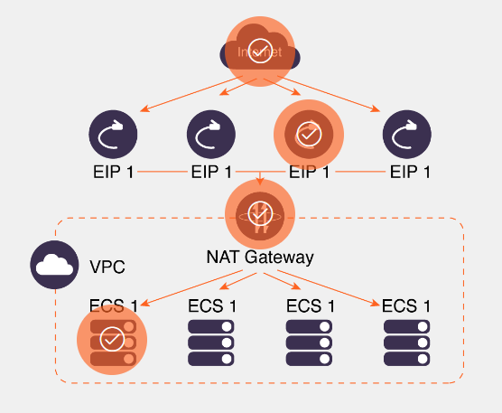

# Introduction to Cloud Security
- Cloud Security strategies should embrace a distributed model ensuring security controls are implemented close to the workloads, applications, and access points (Ingress, Egress points). This distributed approach enhances **visibility**, **control**, and **protection** across the entire cloud infrastructure, mitigating risks and improving overall security posture. 
## Identify New Possibilities and New Risks for Security
By the end of this training, you should be able to:
- Define how the shift to the cloud has created new possibilities and risks for security
- Differentiate security issues with cloud networking over traditional networking
- Explain the definition of cloud security
- Describe the new possibilities for enhanced security

### On-Premises Security Model
Before we explore cloud security, let’s take a dive into the traditional on-premises security model and its associated risks. You'll explore how security solutions were historically deployed in centralized locations, with a strong emphasis on safeguarding internet access through secure DMZ deployment. 
~ In the past, security solutions were mainly implemented on-premises, with a focus on centralized deployment. Internet access was regarded as a highly controlled resource, and devices were typically situated within a tightly secured and centralized DMZ (demilitarized zone) to regulate internet traffic. Organizations relied on specialized hardware security appliances like firewalls, intrusion prevention systems (IPS), and other security devices, which were physically housed within data centers or other on-premise facilities.

### The Traditional Approach
Now, let’s take a look at some of the adversities that come with a traditional approach - remember customers had no choice before the cloud.

**Lengthy Deployment Process:** 
The deployment process was extensive and required a deep understanding of hardware capacity and traffic throughput from the outset. This process involved multiple stages, including hardware procurement, shipping, installation, and meticulous network configuration.

The steps ranged from pre-production deployment and testing to configuration adjustments and final validation, typically spanning several months to years to fully complete the setup.

**Accommodating Traffic Spikes:** 
To accommodate unpredictable spikes in network traffic, particularly during seasonal peaks, it was necessary to procure hardware capable of handling significant increases in traffic. This often led to over-procurement of hardware, which resulted in its underutilization for most of the year.

**Underutilization of Hardware:**
Hardware purchased to handle peak demand periods often remained underutilized during off-peak times, leading to inefficiencies and increased costs associated with maintaining and powering these unused hardware resources.

### Security Vulnerabilities
Security vulnerabilities pose a significant threat to organizations worldwide, particularly within on-premises networks. As technology evolves, so do the methods employed by cyber attackers to breach networks and compromise sensitive data. Let’s explore three critical aspects of security vulnerabilities specific to on-premises networks.

1. **Implicit Trust within Network Perimeter:**
Historically, network security models assumed all devices within the perimeter were trustworthy, which led to vulnerabilities by not accounting for insider threats or compromised devices. This implicit trust model meant that unauthorized access within the network perimeter could remain undetected, posing significant security risks.
2. **Lateral Movement and Targeting High-value Data:**
Once attackers breached the network perimeter, they were able to navigate laterally across the network to target and access high-value data and resources. This ability to move laterally exploited weaknesses in security protocols, allowing critical information to be accessed without detection and leading to significant data breaches and privacy violations.
3. **Challenges of Distributed IT Environments:**
Modern IT infrastructures are increasingly distributed, spanning across both on-premises and cloud environments. This distribution complicates the maintenance of centralized security controls, making it challenging for security teams to monitor and secure diverse endpoints. As a result, gaps in protection arise, increasing the vulnerability of these systems to cyber threats.

### Cloud Security by Definition
Cloud security refers to **the set of policies, technologies, and practices designed to protect data, applications, and infrastructure within cloud computing environments.** It encompasses various aspects of security, including data privacy, confidentiality, integrity, availability, and compliance. Cloud security aims to safeguard cloud-based resources from unauthorized access, data breaches, cyber threats, and other security risks, ensuring the confidentiality, integrity, and availability of data and services in the cloud.

### Navigating Cloud Security Complexities
As organizations increasingly migrate to the cloud, they encounter various complexities and vulnerabilities that require specialized security measures. Understanding these considerations is essential for developing robust cloud security strategies. Ava will explain more.

Cloud environments are inherently distributed, meaning resources and services are spread across various locations and platforms. Traditional centralized security models, while effective in on-premises environments, may not suffice in the cloud due to its dynamic and decentralized nature. However, there are scenarios where a centralized security approach may still be necessary to address specific requirements or compliance standards. In general, cloud security strategies should embrace a distributed model, ensuring that security controls are implemented close to the workloads, applications, and access points, including both Internet Entry (Ingress) and Exit (Egress) points. This distributed approach enhances visibility, control, and protection across the entire cloud infrastructure, mitigating risks and improving overall security posture.

### Securing Cloud Environments
For this section, we will look at the unique security considerations inherent in cloud environments. We will explore how traditional security models may fall short in the distributed nature of cloud computing, and discuss the importance of adopting a distributed security approach. Let's get into the complexities of securing cloud infrastructure effectively.

1. Cloud Environment
   - Cloud computing operates in a distributed manner, spanning across multiple geographical locations. Unlike traditional on-premises setups, cloud environments are not confined to a centralized infrastructure but are spread across various data centers and regions globally.
2.  Zero Trust Model
   - The Zero Trust Cloud Security model challenges traditional trust assumptions by adopting a strict "trust no one" stance. Under this model, every user, device, or component is considered untrusted by default, regardless of their location within or outside the network. This approach ensures that all resource access requests are thoroughly inspected, authenticated, and verified before granting access. Ultimately, how ZTM works is simple: **deny everyone and everything access to a resource unless it is explicitly allowed**.
3.  Traditional Security Deployment
   - Historically, security measures were predominantly centralized within on-premises data centers. However, these traditional security models prove to be less effective in the cloud due to its distributed nature. Centralized security solutions struggle to provide comprehensive protection in decentralized cloud environments.
4.  Dynamic Nature of Cloud
   - Cloud environments exhibit dynamic characteristics, such as ephemeral IP addresses and subnets, especially with the rise of containerized workloads like Kubernetes. In such dynamic landscapes, traditional identification methods based solely on IP addresses become less meaningful. Instead, attribute-based security practices, such as tagging, labeling, and resource identification, play a crucial role in enhancing security posture and risk mitigation.
5.  Distributed Security Deployment
   - Recognizing the distributed nature of cloud environments, security measures must be deployed closer to the workloads, applications, and data they protect. Adopting a distributed security approach ensures that security controls are strategically placed at entry and exit points, enhancing overall protection and threat detection capabilities.
6.  Attribute-Based Security
   - In cloud security, attribute-based practices are essential for adapting to the dynamic nature of cloud environments. Tagging, labeling, and resource identification based on attributes other than IP addresses enable organizations to implement more granular access controls and effectively manage security policies across diverse cloud resources and services.

## Explore Security Risk Scenarios
- Without the ability to implement granular access controls, networks relying solely on NAT may be more susceptible to unauthorized access and data breaches
- By combining NAT with systems that check identities and set flexible access rules, it helps to create a multi-layered security approach which overcomes NAT's limitations ensuring access decisions are based on ongoing checks of user credentials and situation, not ust IP.
- 
***Introduction to Security***:
In this section, we will dive into two critical aspects of cloud security: **egress security risks** and the **challenges associated with centralized firewall deployment**. Understanding these risks is crucial for ensuring the protection and integrity of your cloud infrastructure. Let's explore these topics in detail to strengthen your knowledge and enhance your security strategies. Scroll down to begin.

### Scenario 1 - Egress Security Risk
In today's rapidly evolving digital landscape, safeguarding network boundaries is critical for organizations aiming to thwart unauthorized access and data breaches. This is precisely where Internet Egress security steps in.

Internet egress security plays a critical role in preventing unauthorized access and data breaches.

Traditionally, Network Address Translation (NAT) Gateways have been the go-to solution for managing egress connectivity. While effective in conserving IP-v4 addresses, NAT technology presents its own set of limitations and security challenges, especially in the context of modern security paradigms like zero trust. Let’s find out more about NAT below. 

#### Internet
**Considerations for Network Security**
Organizations should assess NAT's suitability alongside other security measures. Supplementing NAT with additional security layers can mitigate its limitations and improve network security. This includes integrating firewall rules, intrusion detection systems, and encryption protocols to bolster defense mechanisms and protect network infrastructure.

#### EIP1
**Security Vulnerabilities**
Due to its limitations, NAT may leave networks vulnerable to certain security threats. Its broad approach to address translation can hinder effective security measures, posing risks to network security. Without the ability to implement granular access controls, networks relying solely on NAT may be more susceptible to unauthorized access and data breaches.

For example, a company uses NAT, which shows all internal internet requests as coming from one IP address. If the company wants to restrict access to a sensitive database to only the HR department, NAT’s inability to differentiate between users makes it impossible to enforce this policy strictly. Consequently, any employee could potentially access the HR database, increasing the risk of unauthorized access

#### NAT Gateway
**Limitations of NAT**
Unfortunately, NAT, while efficient for address conservation, lacks granularity in access control. It operates in a broad manner, limiting the implementation of fine-grained access control policies. This all-or-none approach can pose challenges in enforcing strict security measures.

#### ECS 1
**Misalignment with Zero Trust**
While NAT alone might not fully match the principles of Zero Trust, which focuses on constant verification and giving users only the access they need, it can still be part of a strong Zero Trust setup if used with other security tools. 

By combining NAT with systems that check identities and set flexible access rules, it helps to create a multi-layered security approach. This combination helps overcome NAT’s limitations, ensuring that access decisions are based on ongoing checks of user credentials and situation, not just IP addresses.

#### Proxy-Type Services
In the realm of network security, organizations often explore various solutions to enhance their infrastructure's resilience against external threats. One such solution is the utilization of proxy-type services like Squid. While Squid offers benefits such as improved response times through caching frequently-requested web pages, it also presents challenges related to management and visibility.

- Proxy services present challenges related to management and visibility

**Benefits of Squid**
- Accelerates content delivery by caching frequently-accessed web pages.
- Improves response times for users accessing common online resources.
**Challenges of Squid Management**
- Lack of centralized control plane complicates management tasks.
- Administration and configuration management may become cumbersome, especially as the network expands.
**Visibility Concerns with Squid**
- Monitoring and detecting data exfiltration can be challenging due to caching mechanisms.
- Without robust visibility tools, identifying security threats may prove difficult.

**In Summary**
Understanding the limitations of traditional solutions like NAT in modern security paradigms is crucial for organizations. By supplementing NAT with additional security layers and exploring alternatives like Squid proxy-type services, organizations can enhance network security effectively. This knowledge empowers organizations to fortify their defense mechanisms and safeguard network infrastructure against evolving security threats.

### Scenario 2 - Risks Associated with Centralized Firewall Deployment
In traditional on-premises setups, centralized firewall deployment has been a stalwart strategy, guiding all network traffic through designated central points. However, as organizations transition to the cloud, this approach encounters formidable hurdles. 

Cloud-native applications, characterized by their dynamic and distributed nature, span across multiple virtual private clouds (VPCs) or networks (VNETs). This decentralization complicates the traditional centralized firewall model, introducing complexities and security risks.

Routing traffic through centralized firewalls in cloud environments significantly expands attack surfaces, requiring supplementary security measures. 

Organizations must adapt their firewall deployment strategies to accommodate the distributed architecture of cloud-native applications. By embracing a more flexible and distributed approach to firewall deployment, organizations can enhance their security posture and safeguard their cloud infrastructure effectively.

#### Further Considerations of Centralized Firewalls in the Cloud
- Latency and Performance
  - Centralized firewalls become bottlenecks due to increased traffic volume. All traffic must traverse the central point, affecting latency and overall performance. This bottleneck can lead to delays in data transmission and response times, impacting user experience and productivity.
- Risk of Attacks
  - Routing traffic from one VPC/VNET to another exposes it to potential threats. Attacks can propagate across the network, exploiting vulnerabilities in the centralized firewall or compromising traffic integrity during transit. This increases the risk of unauthorized access, data breaches, and other security incidents.
- Cost and Scalability
  - Centralized firewalls require additional hardware to handle the load, incurring costs. Egress charges apply even if traffic is blocked at the VPC/VNET level, contributing to operational expenses. Moreover, as network traffic grows or changes, scaling centralized firewalls to accommodate increased demand becomes complex and costly, posing scalability challenges for organizations.

### Large Fault Domain
In cloud security networking, a large fault domain occurs when a single point of failure in one part of the network affects a significant portion of the infrastructure. This occurs when numerous resources or services are grouped together within the same domain, like a data center, availability zone, or region. Any fault or failure within this domain can cause widespread service outage or degradation.

We're going to see the journey of how a single critical network switch failure in a cloud environment can cascade into widespread disruptions, highlighting the challenges and complexities of maintaining resilient infrastructure in the digital era.
- Want to keep infrastructure distributed to create redundancy and avoid failure in system

**Step One - Initial Failure**
A Next Generation FireWall (NGFW) in one availability zone of the Inspection VPC experiences a software malfunction, causing it to stop functioning.

**Step Two - Network Isolation**
As a result of the NGFW failure, the affected Application VPCs are impacted from a security point of view because the traffic is not properly inspected between the interested VPCs. As a consequence, there is no longer secure communication between the resources hosted among the affected VPCs.

**Step Three - Service Disruption**
Services and applications relying on resources within the affected VPCs experience downtime until the traffic is diverted to another available NGFW from the cluster of firewalls. This includes web servers, databases, and application servers that are unable to communicate with their clients or other components.

**Step Four - Cascading Impact**
The service disruption cascades through interconnected systems and dependencies. For example, a web application relying on a database hosted in the affected VPC may become unresponsive, leading to user-facing errors and loss of functionality.

**Step Five - Financial Implications**
The downtime incurred by critical services and applications translates into financial losses for the organization. This includes lost revenue from e-commerce transactions, decreased productivity due to halted business operations, and potential penalties for breaching service level agreements (SLAs) with customers.

**Step Six - Recovery Efforts**
Cloud administrators and engineers work urgently to diagnose the root cause of the NGFW and implement corrective actions. This may involve replacing the faulty software, rerouting network traffic to alternative paths, or provisioning backup resources in unaffected availability zones.

### Impact of Failure
We're going to explore the impact of failure in different network architectures by comparing a centralized architecture and a distributed architecture. This will help us understand how the design of a network can influence the severity of failures and their effects on overall performance. Let's take a closer look to see how they compare.

Understanding the impact of failure in network architectures is crucial for ensuring the reliability and resilience of cloud storage services. It enables you to anticipate potential vulnerabilities, implement effective mitigation strategies, and safeguard the integrity of data storage systems, ultimately enhancing customer satisfaction and trust in the company's services.

### New Possibilities for Enhanced Security
In the ever-evolving landscape of cloud security, new possibilities are emerging, offering enhanced protection while optimizing costs and streamlining processes. Let's explore some of these exciting developments:

**Optimizing Cost:**
- Traditionally, cloud storage companies incurred high costs during peak months. However, with the flexibility and elasticity of cloud resources, there's now the possibility of reducing overall expenses. By dynamically scaling resources based on demand, organizations can optimize costs by scaling down during off-peak periods. This flexible approach ensures efficient resource allocation and cost optimization without compromising performance.

**Automation:**
- Increasing efficiency and agility, automation streamlines security policy creation based on tags rather than traditional IP-centric approaches. This dynamic policy implementation accelerates time-to-market, enhancing operational agility and adaptability. By automating security policies, organizations can respond rapidly to evolving threats and business needs, ensuring robust protection while maintaining agility.

**Enhanced Security Architecture:**
- Cloud security advancements hold significant promise, yet effective security hinges on meticulous design and architecture. A well-crafted security framework not only boosts resilience but also curtails vulnerabilities and upholds regulatory compliance. By adopting a holistic design strategy encompassing scalability, data integrity, and access controls, organizations forge robust security infrastructures resilient against evolving threats.

### In conclusion: 
The evolving security landscape in the cloud offers organizations exciting opportunities to enhance defenses, optimize costs, and drive innovation. Embracing these advancements and implementing robust security practices enable businesses to stay ahead of threats and protect their digital assets effectively

