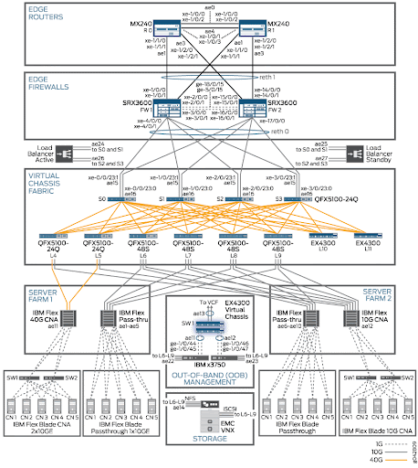
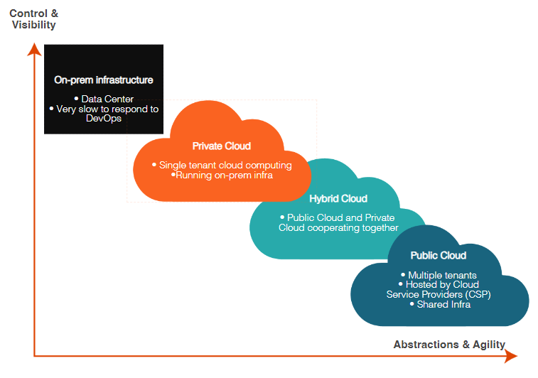
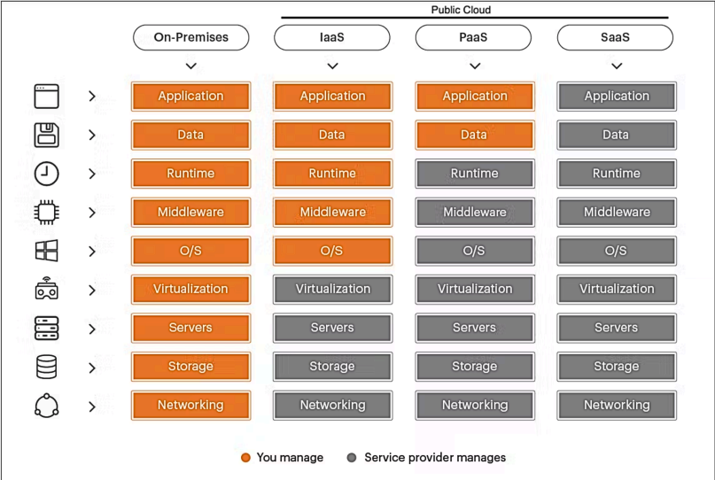

# Introduction to Public Cloud Networking 
- *MY NOTES*

~ *NOTES FROM SLIDES*
## A Brief History
- 1970: On-Premise networks was the traditional model of managing IT infrastructure and organizations. They involve hosting hardware, software, and networking equipment ON-SITE providing control and security over data. LAN were introduced, allowing computers within organizations to connect and share resources on-premises, such as printers and files

~ Established in the 1970s, on-premises networks have been the traditional model for managing IT infrastructure within organizations. They involve hosting hardware, software, and networking equipment on-site, providing control and security over data. In the 1970s, Local Area Networks (LANs) were introduced, allowing computers within organizations to connect and share resources on-premises, such as printers and files.

- 1980: Emergence of WAN enabling organizations to connect geographically dispersed locations. Tech such as leased lines and early IP facilicated communication between sites

~ The 1980s saw the emergence of Wide Area Networks (WANs), enabling organizations to connect geographically dispersed locations. Technologies like leased lines and early Internet Protocol (IP) facilitated communication between sites

- 1990: Internet connectivity became widespread and VPNs gained popularity for secure remote access and connecting branch offices. On-Premise infrastructure remained dominant

~ In the 1990s, internet connectivity became widespread, and Virtual Private Networks (VPNs) gained popularity for secure remote access and connecting branch offices. However, on-premises infrastructure remained dominant.

- 2000: Cloud networking began to gain traction as companies explored different avenues for managing digital infrastructure. Early cloud computing services like AWS offered organizations the ability to host applications and data remotely. Adoption was limited however cloud-based solutions were recongized for their scalability and cost-effectiveness compared to traditional on-premise setups.

~ During the 2000s, cloud networking began to gain traction as companies explored new avenues for managing their digital infrastructure. This era saw the emergence of early cloud computing services like Amazon Web Services (AWS), which offered organizations the ability to host applications and data remotely. While adoption was still relatively limited, forward-thinking companies started to recognize the potential of cloud-based solutions for their scalability and cost-effectiveness compared to traditional on-premises setups.

- 2010: Significant turning point for Cloud Networking with introdutions of major platforms like Azure, GCP. These offerings expanded the capabilities of cloud computing, allowing organizations to migrate increasely complex workloads to the cloud. As cloud technology matured, it became a cornerstone of digital transformation initiatives across various industries. Today, public cloud services play a vital role in powering modern applications and driving innovation on a global scale.

~ The 2010s marked a significant turning point for cloud networking, with the introduction of major platforms like Microsoft Azure and Google Cloud Platform (GCP). These offerings expanded the capabilities of cloud computing, allowing organizations to migrate increasingly complex workloads to the cloud. As cloud technology matured, it became a cornerstone of digital transformation initiatives across various industries. Today, public cloud services play a vital role in powering modern applications and driving innovation on a global scale.

## Identify the Characteristics of On-Premise Data Centers vs. Cloud
### Fundamental Characteristics
In this section, we will look in-depth at the characteristics of on-premises networks and examine how they differ from the cloud.
#### Location and Ownership
*On-Premise Data Centers*
- physically located within organization's premises, fully owned, operated, and maintained by the organization emcompassing all hardware, software, and networking equipment.

~ On-premises data centers, physically located within an organization's premises, are fully owned, operated, and maintained by the organization, encompassing all hardware, software, and networking equipment.

*Cloud Computing*
- hosted in remote off-premise data cetners by 3rd party vendors, subscribed to by organizations on a pay-as-you-go basis elminating the need for owning and maintaining physical infrastructure.

~ Cloud computing services, hosted in remote off-premises data centers by third-party vendors, are subscribed to by organizations on a pay-as-you-go basis, eliminating the need for owning and maintaining physical infrastructure.

#### Infrastrucutre Control 
*On-Premise Data Centers*
- maintain FULL CONTROL over infrastructure emcompassing servers, storage, networking devices and security systems allowing for customization and configuration tailored to their specific needs and preferences.

~ Organizations maintain full control over the infrastructure, encompassing servers, storage, networking devices, and security systems, allowing for customization and configuration tailored to their specific needs and preferences.

*Cloud Computing*
- cloud providers oversee and administer the underlying infrastructure encompassing servers, networking, storage, and virtualization technology while users, who have limited control over physical hardware, can configure and manage resources via web-based interface or API.

~ Cloud providers oversee and administer the underlying infrastructure, encompassing servers, networking, storage, and virtualization technology, while users, although having limited control over physical hardware, can configure and manage resources via a web-based interface or API.

#### Expenditure
*On-Premise Data Centers*
- Capital Expenditure: on-premise data center demands SUBSTANTIAL INTIAL CAPITAL INVESTMENT covering hardware procurement, software licensing, cooling infrastructure, backup power systems, and ongoing facility maintenance.

~ Capital Expenditure - Establishing and managing an on-premises data center demands substantial initial capital investment, covering expenses such as hardware procurement, software licensing, cooling infrastructure, backup power systems, and ongoing facility maintenance.

*Cloud Computing*
- Operational Expenditure: ORGANIZATION PAYS FOR CONSUMED RESOURCES ON A SUBSCRIPTION OR USAGE-BASED PRICING MODEL, covering costs of compute instances, storage, data transfer, and supplementary services like databases, AI, and analytics.

~ Operational Expenditure - Cloud computing operates under an operational expenditure model, where organizations pay for consumed resources on a subscription or usage-based pricing model, covering costs such as compute instances, storage, data transfer, and supplementary services like databases, AI, and analytics.

#### Scalability and Flexibility 
*On-Premise Data Centers*
- scalability is hindered by PHYSICAL LIMITATIONS. If additional resources are needed, they must be purchased then configured

~ Scalability in on-premises data centers is hindered by physical limitations, leading to time-consuming processes like purchasing hardware and provisioning new circuits. This contrasts with cloud computing, which offers rapid scalability on demand, allowing organizations to adjust resources within minutes.

*Cloud Computing*
- virtually LIMITLESS SCALABILITY allowing to adjust resource levels in response to demand fluctuations based on user pre-defined rules or triggers

~ Cloud services provide virtually limitless scalability, enabling organizations to adjust resource levels in response to demand fluctuations, with users able to provision additional resources on-demand or automatically scale according to predefined rules or triggers.

#### Security and Compliance
*On-Premise Data Centers*
- organizations directly OVERSEE the security measures and compliance standards with responsibilties such as implementing physical security protocols, firewalls, intrusion detection systems, encrpytion protocols for data protection.

~ Organizations exercise direct oversight of security measures and compliance standards within their data centers, encompassing responsibilities such as implementing physical security protocols, firewalls, intrusion detection systems, and encryption protocols for data protection.

*Cloud Computing*
- CSP enforce STRINGENT SECURITY MEASURES and COMPLIANCE STANDARDS to protect data and uphold regulatory requirements with encrpytion, identity and access management, network security, and compliance certifications like SOC 2 and ISO 27001.

~ Cloud providers enforce stringent security measures and compliance standards to safeguard data and uphold regulatory requirements, incorporating features like encryption, identity and access management, network security, and compliance certifications such as SOC 2 and ISO 27001.

#### Maintenance and Support
*On-Premise Data Centers*
- hardware repairs, software updates and system monitoring are INTERNALLY MANAGED BY IT STAFF or OUTSOURCED TO 3rd PARTY SERVICE PROVIDERS. organization is accountable for uptime, reliability and performance of the data center infrastructure.

~ Maintenance tasks, including hardware repairs, software updates, and system monitoring, are internally managed by IT staff or outsourced to third-party service providers, with organizations accountable for ensuring the uptime, reliability, and performance of the data center infrastructure.

*Cloud Computing*
- CSP MANAGES MAINTENANCE TASKS such as hardware upgrades, software patches, and infrastructure monitoring while SERVICE-LEVEL AGREEMENTS (SLAs) ensure uptime, performance, and support with ROUND-THE-CLOCK TECHNICAL ASSISTANCE AVAILABLE for critical issues.

~ Cloud providers manage maintenance tasks such as hardware upgrades, software patches, and infrastructure monitoring, while service-level agreements (SLAs) ensure uptime, performance, and support, with round-the-clock technical assistance available for critical issues.

### Core Differences
*On-Premises*
**Definition:** On-Premises (on-prem) data centers are physical infrastructures managed by an organization's IT team. They offer full control over data management processes and customization options.

*Public Cloud: (Abstract)*
**Definition:** A public cloud is a type of cloud computing in which resources, such as servers and storage, are hosted and managed by third-party providers.

## Describe the Differences between Private, Public, and Hybrid Clouds
### Cloud Comparisons
In this section, we will take a closer look at the differences between Private, Public, and Hybrid clouds.

***Control Visibilty***

        ^
        |    
**On-Premise Infrastructure**
- On-prem infrastructure comprises computing resources within an organization, acting as a private data center. This setup provides full control over hardware and software, ensuring high security and customization. However, it requires significant capital expenditure and lacks the flexibility and scalability of cloud solutions. Upgrading and expanding these systems is time-consuming and resource-intensive, which can hinder rapid deployment and innovation.
- Private Data Center
- Very slow to respond to DevOps

        ^
        |
**Private Cloud**
- Private Cloud is Cloud Computing that meets the five characteristics defined by NIST. The typical private clouds are: AWS Outposts, Azure Stack and Google Anthos. You have the most control and visibility with a private cloud, but it may be the slowest in meeting application demands due to its reliance on infrastructure that can be slow to provision. An agile environment is essential for embracing DevOps. 
- Single tenant Cloud Computing
- Running on-prem infra

        ^
        |
**Hybrid Cloud**
- As the name suggests, a hybrid cloud allows the use of the same unified platform to interact with both private and public components.
- Private and Public Cloud cooperating together 

        ^
        |
**Public Cloud**
- A public cloud is where multiple customers or tenants are hosted by a CSP, like Amazon Web Services (AWS), Microsoft Azure, Google Cloud Platform (GCP), Oracle Cloud Infrastructure (OCI), and Alibaba Cloud. Now, these customers or tenants share the same underlying hardware infrastructure in data centers that the CSPs own. Although there are some options to reserve hardware for dedicated instances,  it's mostly a shared infrastructure and a shared tenancy model.
- Muliple Tenant
- Hosted by Cloud Service Provider
- Shared Infra

        ^
        |
***Abstractions and Agility***

### Cloud Services Foundational Models
Before we dive into the specifics of IaaS, PaaS, and SaaS, it’s important to understand these foundational models of cloud services. Each model offers different levels of control, flexibility, and management, making them suitable for various business needs. As we explore Infrastructure as a Service (IaaS), Platform as a Service (PaaS), and Software as a Service (SaaS), you'll learn how they differ in terms of what the provider manages versus what the user manages.

This knowledge will help you determine which model best optimises your operations and leverage cloud computing to its fullest potential.
#### Infrastructure as a Service (IaaS)
- Renting the building blocks of IT
- User configures infrastructure 

~ IaaS infrastructure as a service is where the CSP takes responsibility for the compute, storage, and networking service. The CSP abstracts the hypervisor and gives you access to the guest Virtual Machine (VM). You are responsible for the OS on that VM and all the libraries, middleware, and applications on that VM.
##### Use Cases:
~ IaaS is suitable for a wide range of use cases, including web hosting, application development and testing, data backup and disaster recovery, high-performance computing, and hosting of enterprise applications.
#### Platform as a Service (PaaS)
- Platform to implement code and deploying application, streamlines development process
- User implements code, infrastructure is already configured
PaaS platform is a service is where services are managed for you. You end up with a reduced level of control. For example, you can run a relational database service or platform without needing to install the underlying binaries or be responsible for hardening it or patching it or even ensuring it's uptime. You just need to bring your own code.

~ PaaS platform is a service is where services are managed for you. You end up with a reduced level of control. For example, you can run a relational database service or platform without needing to install the underlying binaries or be responsible for hardening it or patching it or even ensuring it's uptime. You just need to bring your own code.
##### Use Cases:
~ PaaS is well-suited for a wide range of use cases, including web and mobile application development, API development, microservices architecture, IoT (Internet of Things) applications, and data analytics.
#### Software as a Service (SaaS)
- software is hosted by 3rd party provider, access software through web browser
- User uses software, code is already written and hosted on 3rd parties servers

~ SaaS software is a service for the pure consumption of a service. You have no control and, therefore, no responsibility for the application - for example, Microsoft 365 or Salesforce.
##### Use Cases:
~ SaaS is widely used across various industries and for different purposes. Common examples include email and productivity suites (e.g., Gmail, Microsoft Office 365), customer relationship management (CRM) software (e.g., Salesforce), collaboration tools (e.g., Slack, Microsoft Teams), and enterprise resource planning (ERP) systems (e.g., SAP Business One, Oracle NetSuite).

### Public Cloud
One of the most fundamental concepts to grasp when talking about the public cloud is that, at the end of the day, it's just another Data Center. While it may seem abstract due to its virtual nature, the hardware infrastructure of Cloud Service Providers (CSPs) is subject to the same limitations and vulnerabilities encountered in traditional on-premise data centers.

However, the big difference here lies in the ownership and control of the hardware. In a public cloud environment, you're at the mercy of the CSP, and you have no direct control over the physical servers, storage devices, or networking equipment that your applications run on. This lack of direct control means that your organization relies heavily on the CSP's reliability, security measures, and compliance adherence. It also implies a shift in mindset from owning and managing hardware to managing service-level agreements (SLAs) and optimizing resource utilization in a shared environment.

#### Definitions
**Private Clouds:** Provisioned for exclusive use by a single organization. It should provide capabilities such as on-demand self-service, broad network access, resource pooling, rapid elasticity, and measured service. Managed internally or by a third party, or some combination of them, ideal for sensitive data handling. It may exist on or off premises.

**Public Clouds:** Operated by third-party providers, public clouds provide scalable and cost-effective cloud computing resources accessible over the internet.

**Hybrid Clouds:** These combine on-premises or private clouds with public clouds, enabling fluid data and application movement between environments. They maintain data control and security while offering scalability.

**On-prem Infrastructure:** Consists of physical and virtual resources within an organization’s own facilities, providing high security and control but requiring significant investment and ongoing maintenance.

## Outline the Cloud Networking Ecosystem
### The Cloud Networking Landscape
For this section, we will be exploring exactly what makes up the Cloud Networking ecosystem.

- Cloud and On-Prem can be combined to met business needs and requirements.

~ Businesses widely favor the public cloud for its on-demand availability, scalability, service-based model, and agility. However, a comprehensive cloud networking ecosystem typically combines public cloud and on-premises networking and security services. While the public cloud provides the majority of networking and security services for critical workloads, some business requirements call for connectivity to on-premises resources.

#### Public Cloud
- Public Cloud services are versitile and provide an array of support for businesses. Certain business imperatives demand direct connectivity to ON-PREM resources

~ The **public cloud** serves as the cornerstone of this ecosystem, offering an array of networking and security services to support crucial business workloads hosted within its infrastructure. Despite the many advantages provided by the public cloud, certain business imperatives demand direct connectivity to on-premises resources.

~ **On-Premises Resources:** These include existing data centers, legacy branch offices, SD-WAN branches, colocation facilities (colo), and IoT devices (sensors and devices that collect data and communicate with the cloud for real-time insights and automation). These resources can connect securely to the public cloud using various connectivity methods. All these resources combined are categorized as Edge resources as well.  

~ **End User Devices:** End User Devices refer to the array of devices used by individuals, including employees, contractors, developers, and others. These devices encompass laptops, IoT, desktops, tablets, and phones, serving as the interface through which end users access and interact with cloud resources.

What role do on-premises resources play in the public cloud networking ecosystem?

#### On-Premises Resources
On-Premises resources play a crucial role in the public cloud networking ecosystem because:
- **Compliance:** Federal requirements and GDPR regulations might necessitate storing certain data on-premises.
- **Legacy Systems:** Integration with existing on-premises systems might be necessary for certain business processes.

~ The public cloud does not replace all on-premises infrastructure. While on-prem data centers may seem outdated, on-premises resources remain integral to the broader cloud ecosystem, especially for businesses with unique requirements. The critical task lies in identifying advanced network connectivity solutions that offer agility, visibility, and control, addressing business considerations across the entire cloud environment.

**The Hybrid Networking**
- The Hybrid Networking ecosystem combines public cloud services and on-premises resources.

**Resources**
- Advanced connectivity to on-premises resources is still **needed for compliance, low-latency processing, and legacy systems**.

**Infrastructure**
- On-Premises resources encompass a wide range of infrastructure, including data centers, branch offices, colocation facilities, and IoT devices, all vital in supporting cloud connectivity.

**Critical Role of End User Devices**
- End-user devices such as laptops, desktops, tablets, and phones are the primary interface for accessing cloud resources, highlighting their significance in the overall cloud networking ecosystem.

## Examine the Design Considerations and Tradeoffs for Moving to Cloud
### Moving to Cloud
Moving from on-premises infrastructure to the cloud involves shifting data and applications from physical servers within an organization to cloud-based platforms and services managed by external providers.

- Cloud provides speed and agility to deploy applications and resources. Enterprises use cloud to adapt quickly.

1. Agility, Automation, Innovation, Faster Time to Market
- agility, automation, and innovation leading to a faster time to market for enterprises

~ The allure of the public cloud lies in its ability to foster agility, automation, and innovation, ultimately leading to a faster time to market for enterprises. By leveraging cloud resources, businesses can rapidly develop, deploy, and iterate on applications, staying ahead of the competition in dynamic market landscapes.

2. Application Turnaround and Uptime
- faster application turnaround and uptime is highly available and resilient infrastructure

~ Cloud agility enables swift application turnaround, allowing businesses to adapt to changing market demands and customer preferences quickly. Equally crucial is ensuring application uptime meets stringent service level agreements, a feat made achievable through the resilient infrastructure and high availability features the cloud offers.

3. Auto-Scaling
- auto-scaling allows for resource allocation based on demand dynamically which ensures optimal performance and cost-efficiency. auto-scaling handles workload without manual intervention.

~ The flexibility of auto-scaling in the public cloud empowers enterprises to adjust resource allocation based on demand fluctuations dynamically. This ensures optimal performance and cost-efficiency, seamlessly allowing businesses to handle varying workloads without manual intervention.

4. Hardware Ownership vs. Pay-as-you-go Model 
- Once migrate to the public cloud, there is no need to invest in and maintaining physical hardware infrastructure. Pay-as-you-go model shifts from capital to operating expenses offering financial flexibility and scalability **aligning costs with actual usage**.

~ When enterprises migrate to the public cloud, they no longer need to invest in and maintain physical hardware infrastructure. Instead, they embrace a pay-as-you-go model, only paying for the resources consumed. This shift from capital to operating expenses offers financial flexibility and scalability, aligning costs with actual usage.

### Considerations When Moving to the Cloud
- public cloud enables greater AGILITY and SCALABILITY in building and deploying solutions, it requires relinquishing some control compared to on-prem setups

1. Urgency of DevOps drove cloud migration. Network components like routers, switches, and firewalls don't seamlessly align with cloud infrastructure. Instead, the cloud offers its own suite of infrastructure servers to support application development. 

~ DevOps drove the cloud migration, leaving networking and security teams trailing. Traditional networking components like routers, switches, and firewalls don't seamlessly align with the cloud's infrastructure. It's not a direct translation from on-premises to cloud; instead, the cloud offers its own suite of infrastructure services to support application development.

1. The focal point of networking and security has shifted dramatically with CSP granting immediate internet accessibility by assigning application a public IP address.

~ So, from a networking and security standpoint in the public cloud, the focal point of networking and security has shifted dramatically. Unlike on-premises setups, where applications typically pass through a DMZ for security inspection, public cloud environments, with certain cloud service providers (CSPs), grant immediate internet accessibility by assigning applications a public IP address.

3. on-prem networking elements differ from CSP networking elements.

~ Enterprises must adapt to a vastly different model in the cloud. Even foundational networking elements like route tables are managed differently by each CSP. Additionally, new services such as Identity and Access Management (IAM) are introduced, with each CSP offering its distinct version alongside unique managed services for networking and security.

4. 

~ Navigating this complexity while maintaining an agile and secure operational framework to meet evolving business demands poses a significant task - but is an achievable one.

### Design Considerations
1. Considerations with Building
- CSP offer foundational constructs like VPC, route tables, subnets, and compute instances. User determines how they use and integrate these components. There is a lack of standardized best practices.

~ Considerations with Building: Cloud Service Providers (CSPs) offer foundational constructs such as virtual private clouds (VPCs), route tables, subnets, and compute instances. However, it's up to the user to determine how to use and integrate these components to accommodate their applications effectively. Unfortunately, there's a lack of standardized best practices or reference architectures for networking.

2. Considerations with Operations
- CSP lack comprehensive toolkit for managing networking environments. Notable absence of tools tailored to troubleshoot network issues rapidly.
  
~ Considerations with Operations: CSPs currently lack a comprehensive toolkit for managing networking environments efficiently. While basic tools like flow logs exist, their export capabilities are often limited, and visualization options must be improved. Furthermore, there is a notable absence of tools tailored to troubleshoot network issues rapidly.

3. Considerations with Growing
- CSP don't advocate for multicloud systems

~ Considerations with Growing: Consider a scenario where your business requires expansion from a single region to multiple regions or even to another cloud—a trend rapidly gaining momentum. Unfortunately, none of the CSPs is particularly incentivized to assist in expanding to other clouds, as providing multicloud support doesn't align with their best interests. In fact, some CSPs actively avoid using the term "multicloud" altogether.

